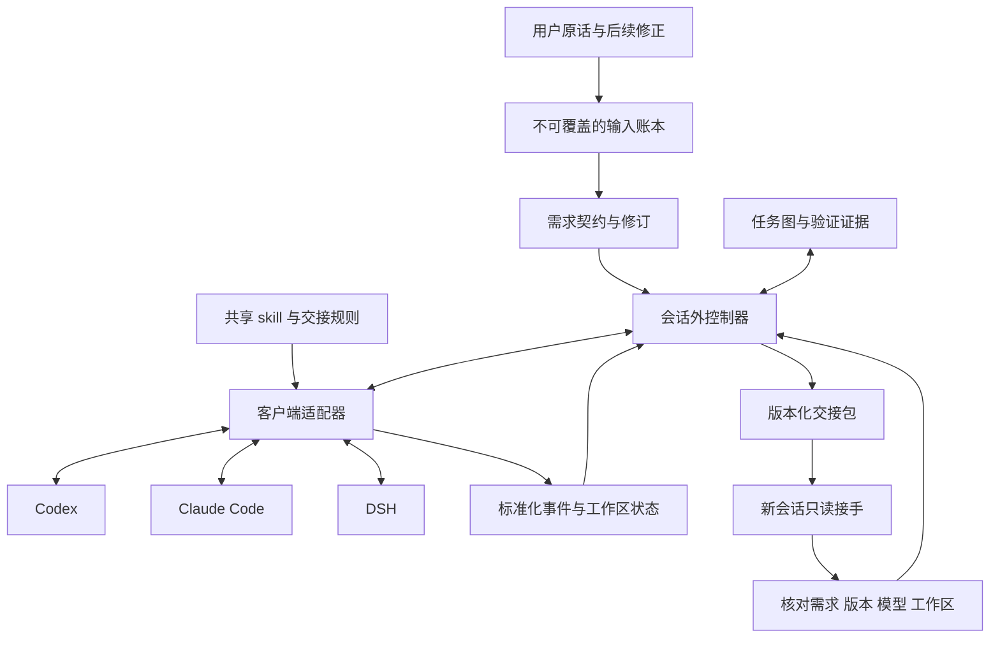
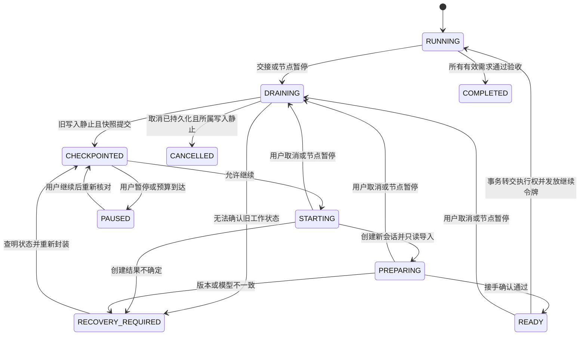

# 长任务自动交接技术设计

版本：提案 v0.1；2026-09-17。以下模块、接口和默认值是拟开发协议，不是已经存在的命令。平台事实见 [调研](02-现有工具与平台调研.md)，需求源见 [原始需求](01-需求与用户原话.md)。

## 1. 架构与职责



共享 skill 负责让 agent 按需求组织工作、报告状态、生成交接建议。控制器负责计数、触发、持久化、校验、建会话、重试、转交执行权；生命周期动作不能只依赖模型自觉。

控制器应复用选定基座的循环/任务存储能力。本文的状态模型是跨适配器契约，不强制另造一套任务系统。若 P0 决定使用 Ralph Orchestrator，则新增能力放入其扩展层；只有后备自研路线才需要完整实现本文的存储和 supervisor。

### 能力分级

| 级别 | 含义 | 可对用户宣称 |
|---|---|---|
| L1 | 只保存状态、生成交接材料 | 辅助交接 |
| L2 | 自动新上下文执行，但在独立控制器/子 agent 中 | 自动续跑，入口有限 |
| L3 | 同客户端新根会话自动续跑，原界面可见可接管 | 满足本需求的主要体验 |
| L4 | 额外自动创建独立 OS 窗口 | 可选显示能力 |

三客户端分别标级。若某个只能做到 L2，不能把总体标为完整三端 L3。

## 2. 启用、常驻与用户交互

用户一次启用选定项目/任务的自动交接。记录运行授权范围和启用策略；后继会话自动注册到同一 run，不需要再次启用。全局 skill 自动发现不等于所有会话都自动受控。

启动时做能力检查：适配器版本、事件来源、是否能捕获原始输入、是否能新建会话和传递配置、是否可只读接手、是否能停止自己管理的工作进程。检查失败须明确显示能力等级；不能无声退化成普通提示词。

建议提供这些控制动作，命令名留待基座选择：查看状态、下一安全节点暂停、立即停止、继续、查看会话链、禁用自动交接。立即停止的优先级高于自动续跑；“下一节点暂停”会整理检查点但不创建下一 worker。

普通查看窗口关闭，不应杀掉会话外控制器。控制器由宿主插件服务、已有守护进程或独立 supervisor 持有；CLI 的临时 hook 子进程不能承担常驻职责。休眠、重启和控制器崩溃后的恢复先检查持久状态及 pause/cancel 标志，再决定续跑。

首次安装/信任遵循客户端的要求，不设计绕过流程。正常轮换、整理和已授权范围内执行不再反复请求用户确认。

## 3. 稳定记忆：保留依据，更新状态

### 分层数据

| 数据 | 内容 | 谁能改变它 |
|---|---|---|
| 原始输入账本 | 用户完整原话、消息 ID、时间、来源、附件引用、内容哈希 | 输入适配器追加；agent 不可覆写 |
| 需求契约 | 目标、范围、禁止项、验收标准、对应原话 ID、版本 | 根据用户输入生成修订；agent 建议与用户要求分开 |
| 决策记录 | 已选方案、理由、适用范围、失效条件、来源 | 追加，标记替代关系，不删除历史 |
| 任务图 | 稳定任务 ID、依赖、需求引用、状态、下一动作 | 经控制器验证后更新 |
| 证据存储 | 工作区基线、差异、测试结果、产物引用、执行时间 | 执行器记录，控制器核对 |
| 交接快照 | 上述版本引用、当前进度、风险、下一任务、模型环境 | 每次生成新版本，不覆盖上一包 |

摘要是索引和导读，不是原话的替代品。每次交接从原始输入、当前契约、任务状态与证据重建。不要执行“第 N+1 份摘要只总结第 N 份摘要”。

后续用户修正优先于较早要求，但只改变对应范围。原始请求仍留存，通过 `supersedes` 指向被替代条目。用户问进度、问原因、补充背景，不默认视为取消原目标。系统生成的续跑提示虽可能经 user-role 传输，必须标记为 `generated_handoff`，不得被录为新的“人类授权”。

导入既有会话时，先读取仍可获取的原始记录并标注来源。只剩压缩摘要时，记录 `original_input_complete=false`；不能伪造原话，也不能宣称已经完整恢复需求。

### 权威存储

优先使用已选基座的事务存储；后备自研建议本地 SQLite 记录权威状态，文件存储不可变材料，Markdown 为可重建投影。任务图只能有一个权威来源。若采用 Beads/GSD，则保存外部任务 ID 与版本映射，而非双写两套真相。

控制器状态应在 agent 的项目编辑权限之外；agent 通过受限的“提交状态建议”接口报告。若宿主不能阻止直接改写控制数据，应披露只能做校验/审计，并在文件哈希异常时停止，不能宣称已经强制防篡改。

## 4. 任务切分与防跑偏

每个工作单元应有：输入范围、需求引用、预期产物、验证方式、依赖、允许触碰的路径/资源、完成条件。建议以 15～45 分钟的可验证工作作为初始粒度，但根据实际复杂度调整，不以时间强行分割原子操作。

在启动单元前、单元完成后、压缩恢复后、接手前检查：

1. 下一动作能否追溯到仍有效的需求。
2. 是否引入用户未要求的功能、重构、依赖或平台迁移。
3. 是否违反明确的“不做”与已否决决策。
4. 当前成果能否由指定验收证据支持。
5. 最近动作是否只是重复相同尝试，未产生有效进展。

工程上必需的补充动作可以创建子任务，但需注明它服务的需求与最小必要性；不能把“可能有用”升级为新产品范围。已知越界计划停止派发，自动回到最近的有效任务；只有无法从原话消除的重大目标歧义才请求澄清。

路径范围、需求引用存在性、版本和任务状态是确定性校验；语义必要性由模型辅助检查，存在漏报和误报。必要时提供不同上下文的审阅，但不默认增加多模型或昂贵双重审查。测试通过也不能证明所有用户意图被满足。

## 5. 触发策略

### 可观测信号

- 明确的压缩完成事件：分别记录当前会话次数和整个 run 次数，不把压缩尝试或 hook 重放算作成功压缩。
- 当前有效上下文占用：只有客户端提供可靠指标时使用；累计计费 token 不能当作上下文占用。
- 活跃执行时间：扣除等待用户、休眠和外部等待；墙钟时长另存。
- 工作单元完成、任务队列长度、下一单元预计规模。
- 用户要求下一节点暂停或立即停止。
- 无进展、相同失败重复、目标偏移迹象、客户端运行失败。

### 建议初始策略（可配置、未校准）

| 条件 | 建议行为 |
|---|---|
| 单元完成且存在下一单元，并且是长任务/多单元模式 | 正常交接；简单且连续的小动作可归同一单元 |
| 当前会话首次成功压缩 | 重新读取目标锚点并排队交接 |
| 同会话第二次成功压缩 | 提升优先级，不再开启新工作单元 |
| 活跃时间达到 45 分钟 | 请求在下一安全节点交接 |
| 可靠上下文剩余额度不足下一单元 + 交接储备 | 不开启下一单元，优先整理；初始可在占用约 65% 时预警 |
| 连续 3 次相同动作/故障且无证据进展 | 进入诊断/阻塞状态；换窗口不能重置该计数 |
| 用户暂停/总预算边界到达 | 持久化后停止，不能自动开启后继 |

所有数值是建议调参起点。自动模式应在单元边界主动轮换，不必等到发生第二次压缩。压缩事件不可用时依赖任务边界与活跃时间，明确显示指标未知，不能让模型猜“我被压缩几次”。

上下文预算关系：`当前上下文 + 下一单元估计输入/输出 + 整理与恢复储备 < 有效上下文上限`。估计量与观测量分开存储。交接包预算必须考虑系统提示、工具 schema 与原话；超限时缩小任务单元和证据摘录，不截断当前有效的硬约束。

只要还有足够上下文，收到交接请求后允许当前单元收尾；建议超过 10 分钟仍不能收尾就生成部分检查点。到期不强杀任意外部事务：停止派发新写操作，尝试受支持的中断，确认静止；无法确认则保持待恢复状态且不启动新写入者。

## 6. 安全节点与部分完成

“安全节点”必须同时满足：

- 当前单元已达到验收边界，或已记录精确的部分状态。
- 旧 agent、相关子 agent、工具调用、后台写进程已结束，或明确转交给可恢复管理者。
- 当前工作区状态、验证结果和下一步已持久化。
- 不存在未判定结果的发布、迁移、付款等外部动作。
- 暂停/取消和最新用户修订已被处理。

不是所有单元都必须让全部测试通过才能交接。测试失败可以是合法的部分检查点，任务保持 `in_progress`，记录失败命令、输出和下一个诊断步骤。`completed` 必须有当前版本的通过证据。

对运行时间很长的构建/训练，记录作业 ID、进程关系、日志位置、输出位置和重新连接方式。无法跨会话安全拥有该作业时应等待或暂停，不伪称已完成。

## 7. 交接状态机与执行权



同一物理工作区在所有受控 run/客户端之间只允许一个活动写入 owner。控制器采用宿主级工作区注册表：规范化绝对路径，解析符号链接/Windows junction，结合实际目录与 worktree 身份生成 workspace_key；Windows 按文件系统的大小写规则处理。重复启用同一工作区返回既有 run，不能新开另一个独立锁。独立 worktree 可以各自注册；未纳入控制的人工或其他 agent 编辑无法由本锁阻止，只能通过指纹检测并暂停协调。

数据库租约用于协调，但租约超时不能证明旧进程已经不写文件。必须结合会话中断完成、子进程静止确认和可执行的 fencing/权限控制。工作区注册表与 run 状态须有一致的持有者校验，不能每个 run 自己创建互不相见的锁。

### 交接顺序

1. 记录 `handoff_requested`，设置不再开始新单元，分配稳定 `handoff_id`。
2. worker 收尾，提交完成/部分状态建议；控制器核对证据并等待所有所属写操作静止。
3. 固化原话水位、需求版本、任务图版本、模型配置、工作区指纹与证据清单。先完整写快照文件，再在事务内发布引用和状态；崩溃产生的孤立文件可清理，数据库不得指向半写文件。
4. 将新会话创建意图写入 durable outbox。查重后调用适配器；记录返回的 session ID。
5. 新会话以**宿主可执行的只读权限**或等价门控启动，只做读取与接手确认。仅写在提示词里的“请勿编辑”不算权限隔离。
6. 新会话返回 ACK：run/handoff ID、需求版本、已读取材料哈希、工作区指纹、任务 ID、下一步、有效模型。控制器独立核对字段和当前工作区。
7. 事务中 CAS 同时核对 workspace_key、旧 owner/epoch、输入水位、契约版本、控制意图版本以及 pause/cancel 状态，再更新 owner 和 epoch，封存旧会话为 superseded。随后发送带当前 epoch 和版本水位的执行令牌；发送与消费令牌时都再核对，旧 owner 的后续动作拒绝。
8. 新会话进入执行，继承触发策略和所有 run 级计数。旧会话保留可查，不自动删除。

ACK 不是目标理解的绝对证明；它验证材料和状态一致性，下一步仍经过需求检查。不能让 agent 自己宣称“我已拿到锁”就开始写。

### 用户输入与交接并发时的规则

| 输入到达位置 | 必须动作 |
|---|---|
| RUNNING / DRAINING | 先追加输入并增加控制意图水位；下一节点暂停只允许当前单元收尾；立即停止请求中断所属动作 |
| CHECKPOINTED / STARTING / PREPARING / READY | 暂停/取消不允许发放执行令牌；回收新会话的准备工作，确认静止后进入对应终态；需求修订使旧包与 ACK 失效 |
| owner CAS 之后、令牌消费之前 | 取消/修订令牌并增加 epoch；新 owner 仍只能只读；重新整理或暂停 |
| 令牌消费之后 | 每次派发写工具前检查当前 epoch/意图水位；停止时阻止下一动作并中断正在运行的所属动作，已执行的副作用按恢复记录处理 |

立即停止不能承诺撤回已经执行的操作。只有确认静止才能标记 PAUSED/CANCELLED；无法确认进入 RECOVERY_REQUIRED，同时保留取消意图。上述规则适用于所有非终态，不以主图未画出某条边为由忽略输入。恢复必须重新读取最新意图，不能恢复已撤销的继续令牌。

### 崩溃与重试

外部会话创建通常没有通用 exactly-once 保证。本设计承诺至多一个被授权的活动写入者，并尽量避免重复会话；不宣称永远不会产生空的孤立会话。

- 同一 handoff 重试保持相同 ID。先查 outbox、映射和目标会话状态，再决定是否重发。
- 创建成功但响应丢失：通过可用元数据/会话列表查找；无法确定时进入恢复，不盲目重建并执行。
- 新会话已 ACK 但继续令牌未送达：重发可去重的令牌，不能重新执行已提交的任务。
- 新会话失败：核实其未获得写权或已静止，保留快照；有限重试。回用旧会话也必须重新申请当前 epoch。
- 控制器掉线：阻止启动新单元；若适配器不能撤销旧进程写入能力，不能在另一实例上凭租约过期接管。
- 用户在交接中输入：输入入账并增加水位。转交执行权前发现新消息，则失效旧 ACK、更新契约/快照；取消优先。

## 8. 交接包契约

建议的文件投影，不要求这些文件全都塞进 prompt：

```text
relay-data/<run-id>/
  inputs/<message-id>.json       # 原始输入；主控维护
  contracts/<revision>.json      # 当前契约及来源
  evidence/<artifact-id>/        # 差异、命令结果、文档等
  handoffs/<handoff-id>/
    manifest.json               # 版本、校验和、索引
    resume.md                   # 适合模型阅读的入口
    workspace.json              # 位置、基线、变化、作业
  state.md                      # 从权威状态生成的用户视图
```

`manifest` 至少包含：

| 字段组 | 必须信息 |
|---|---|
| 身份 | schema_version、run_id、handoff_id、parent_session_id、目标 adapter、sequence、created_at |
| 需求 | 原始消息水位/引用/哈希、original_input_complete、contract_revision、目标/硬约束、被替代要求索引 |
| 任务 | 权威任务源及版本、当前 task_id、状态、依赖、完成证据、下一动作、blocked 原因 |
| 模型 | requested/effective provider 与 model、reasoning effort、解析状态、配置指纹 |
| 环境 | cwd、repo/worktree/branch、HEAD、dirty/untracked 清单、基线/产物哈希、工具与权限配置引用 |
| 运行 | pause/cancel 状态、总 token/费用/时间/轮换预算、使用量可信度、无进展次数、活动作业 |
| 完整性 | 文件清单及哈希、来源分类、交接原因、epoch、验证证据引用、交接包版本 |

`resume.md` 阅读顺序：当前目标与硬约束 → 最新用户修正 → 当前单元和验收 → 已完成且经验证内容 → 未完成/失败/未知 → 工作区和作业 → 下一具体动作 → 进一步证据索引。

原话全文永久保存且可追溯；新上下文总是携带当前有效目标、硬约束、最新修正及其来源片段。原话较短时全文内联；很长时提供索引并要求接手前读取相关原文。不能用“节省 token”为由删除禁止项或最新修正；材料仍装不下时重新切分任务。

附件保存可访问引用和校验和；需要视觉证据时不能只留下“用户上传过一张图”。凭据只存配置引用，不复制 API key 到交接包。来自网页、仓库或工具的文字标为证据，不提升成控制指令。

## 9. 保持模型与环境

捕获交接时的有效配置，不只读取全局设置。保留用户中途 `/model` 或其他方式调整后的值。别名要记录 requested alias 和可获得的 resolved ID；只能读到别名时标记可验证程度，不能宣称快照模型绝对相同。

配置分成 `execution_config` 与 `preparation_overlay`：前者等于原会话允许的执行环境；后者只在接手阶段进一步限制写操作。ACK 需证明模型/cwd/关键配置一致、目标执行权限不超出原值，且只读 overlay 确实有效。接手成功后控制器解除 overlay，再核对实际权限/工具集合等于 execution_config；不能因只读阶段权限较少误判为配置漂移，也不能借解除 overlay 扩权。适配器若无法实现可验证的阶段转换，P0 不能宣称通过。

新会话启动后核对 provider、effective model、reasoning effort，以及上述分阶段配置。模型变为默认值、不可用、或发生非预期路由时暂停新的写操作；除非用户另行允许，不启用自动 fallback。平台强制路由可能无法事前阻止，必须如实记录，不能承诺服务端永不切换。

summary 生成也优先使用当前模型/已有能力，不偷偷引入另一个付费模型。若原会话已无足够上下文，先从持久状态生成确定性的最小交接包；后继只读阶段补充核对。认知状态、缓存和隐藏推理不是可迁移对象，迁移的是显式需求、证据、决策和下一步。

配置继承不等于扩权。原工作在计划模式，新会话仍受计划模式约束；自动续跑也不授予发布、推送等原任务没有的许可。

## 10. 平台适配器契约

以下为拟定接口语义，不能直接当成平台现有 API 名称：

| 操作 | 输入 | 输出与保证 |
|---|---|---|
| capabilities | 安装版本、入口类型 | 事件、新建、回读模型、只读门控、停止、原生呈现等能力 |
| inspectSession | 精确 session ID | 有效模型、cwd、状态、子作业；未知字段明确 null |
| subscribe | session ID、cursor | 带稳定事件 ID/序号的事件流及重放语义 |
| requestDrain | session ID、handoff ID | 排队交接；返回 receipt 不代表已经静止 |
| awaitQuiescence | owner、所属作业、截止条件 | quiescent/unknown/failed 及证据 |
| createFresh | launch config、handoff ID、只读约束 | 新 session ID、有效配置、是否原界面可见 |
| authorizeExecution | session ID、epoch、契约/输入水位、execution_config | 原子核对最新控制状态后解除只读 overlay；回读实际权限；失败保留只读且不派发写工具 |
| submit | session ID、消息 ID、内容、epoch | 接收凭据/不确定状态；需要查重 |
| reveal | session ID、显示策略 | 原生打开/可定位/不支持，不能假报成功 |
| interruptOwned | session ID、所属作业 | 中断结果；不影响共享 runtime 的其他任务 |

标准事件包括 user_input、task_report、tool_start/end、compaction_started/completed、context_usage、session_idle、model_changed、worker_lost、pause/cancel。保留原生事件附录、观察时间与来源；映射失败应可诊断。

### 平台路线

- **Codex**：app-server 作为主要执行接口；hooks 补充启动/压缩时的锚点注入。桌面工具集合作为宿主内专用路径，不能成为跨客户端共享 skill 的硬依赖。原生呈现与全局 CLI/runtime 兼容性前置验证。
- **Claude Code**：插件/hooks 采集与注入，CLI/SDK supervisor 管理会话。新 UUID 与结构化输出用于关联；不用 resume/fork 代替 fresh。保持原有登录路径与权限。
- **DSH**：原生插件掌握压缩和停止边界，SDK 创建新 session。当前 SDK 没有逐会话取消请求，不能编造映射；独占 worker 或原生 service 实现后才能承诺中途停止。Web/Desktop 显示需单独验证。

## 11. 工作区保护与回退

第一次接管就记录原有 dirty/untracked 状态；这些属于用户基线，不能归为 agent 新增变化。任务执行前后记录文件指纹与差异，二进制和新文件也要覆盖。仅 Git commit ID 不足以保存未提交内容。

检查点默认不自动 commit、不 stash、不 reset。若需真正可恢复快照，可使用隔离 worktree 或受控内容存储；必须考虑未跟踪文件、二进制、大文件、空间不足与已有用户修改。回退先生成变化预览，按用户意图执行，不覆盖新出现的用户编辑。

SDK 同 cwd 访问并不意味着与桌面保存项目的 worktree 相同。恢复前核对绝对路径、repo identity、branch/worktree 与内容指纹，错目录时拒绝执行。

外部动作不能靠文件快照撤销。持久记录动作 ID 和结果，网络超时后先查询结果；无法查询则等待处理，不重复发布或提交。

## 12. 预算、重试与可见性

run 级累计信息跨窗口不清零：token、已知成本、活跃时间、轮换数、失败签名、无进展次数。不同客户端用量定义可能不同；未知费用显示未知，以可观测轮次/时间作保底，不编造精确金额。

建议短暂网络失败最多自动重试 3 次，带退避并尊重服务端 retry-after；鉴权、模型不可用、权限和用户取消不靠换窗口重试。这个重试计数与无进展次数独立，并在后继会话继承。

状态卡显示：当前目标一句话、任务完成数/总数、当前单元、验证状态、交接原因、旧→新会话、模型、暂停原因、下一动作。任务总数变化有原因记录，不展示虚假的百分比。正常交接可静默记录，完成、失败、需用户动作时通知；不要求用户点击每次接手。

## 13. 包装与实现边界

共享 `SKILL.md` 只承载必要行为规则与引用，平台 hooks/插件配置分别维护。安装器探测已有设置并做合并/备份，不覆盖 AGENTS.md、CLAUDE.md 或用户 hooks。卸载只移除本工具自己的配置。

本机 Windows 为第一验证环境；不以 Bash/tmux 为强制依赖。控制器若需自研，建议 TypeScript 便于对接 JSON-RPC/Node 插件；是否引入 SQLite 库、测试框架或 Rust 扩展，由基座与版本探针决定，不在当前文档锁死未经验证的依赖版本。

首版只做串行会话交接。多 worker 并行、跨设备、跨模型切换、云端长期记忆均不属于完成当前需求所必需的工作。
