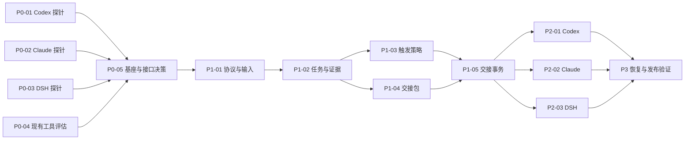

# Agent Relay 开发任务清单

状态：全部为后续开发工作，本轮未执行。此清单允许下一窗口独立接手，但本身不是启动实施的指令。

**目标：** 在三个客户端内实现按进度自动交接、保持模型、保留原始意图并连续续跑。

**架构：** 共享协议与 skill；会话外控制器；三个适配器。优先扩展现有控制器；仅 P0 证明必要时采用最小自研核心。

**技术：** 复用基座优先；自研候选为 TypeScript、JSON-RPC、本地事务状态和不可变文件。依赖版本在探针后确定。

**依据：** [需求](01-需求与用户原话.md)、[调研](02-现有工具与平台调研.md)、[技术设计](03-技术设计.md)、[验收](05-验收与接手说明.md)。

## 全局约束

- 先确认 Windows 与三个原生入口的能力，再承诺三端支持。CLI/SDK 成功不代替桌面 L3 验收。
- 用户原话不可覆盖；用户修订有来源；任务 ID 可追溯。
- 模型/provider/effort 不悄悄变化；配置未知不能标为已验证。
- 同一物理工作区跨所有受控 run/客户端只有一个获准写入的 owner；接手前须只读。
- 用户暂停、取消与预算状态跨会话继承；不得以换窗口规避。
- 保留用户已有未提交修改；不自动 reset、stash、commit、push 或部署。
- 自动交接不能要求每次点击确认；真实缺失权限或用户决策另行处理。
- 若复用基座，下面拟定模块映射到基座扩展位置，不另建重复任务数据库。

## 1. 阶段与依赖

阶段可以分步交付：P0 产出经实测的可行性与复用决定；P1 产出假适配器上的完整闭环；P2 产出真实客户端集成；P3 验证长期运行和包装。**最终完成仍要求三端约定级别全部通过。**

## 2. 拟定模块边界

这些是后备自研路线的建议路径，不是本轮已创建文件。

| 模块/路径 | 责任 |
|---|---|
| `packages/protocol/` | 需求、任务、事件、交接包、ACK 和适配器数据契约 |
| `packages/controller/inputs/` | 原始消息捕获、来源、水位、修订 |
| `packages/controller/tasks/` | 权威任务系统适配、需求映射、证据绑定 |
| `packages/controller/policy/` | 触发、上下文与总预算、无进展检查 |
| `packages/controller/handoff/` | 状态机、outbox、owner/epoch、只读接手 |
| `packages/controller/workspace/` | 基线、差异、所属进程与恢复验证 |
| `packages/adapters/{codex,claude,dsh}/` | 原生事件、启动配置、呈现、停止 |
| `skills/agent-relay/` | 共享行为规则和按需引用 |
| `integrations/` | 三端安装与配置合并、状态入口 |
| `tests/{contracts,integration,faults,scenarios}/` | 契约、真实适配、故障与长任务评测 |

## 3. P0：先证明可行与复用价值

### P0-01 — Codex CLI 与桌面入口探针

依赖：无。覆盖 R4/R5/R8。

- [ ] 分别记录全局 CLI 与桌面 runtime 版本、hook 支持/信任状态；读取实际可用协议。
- [ ] 在独立测试目录启动两次全新会话，记录 thread ID、旧历史是否进入、新模型与 cwd、权限及工具一致性。
- [ ] 验证桌面是否可见、可定位并接管新 thread；区分宿主内工具与外部 app-server 能力。
- [ ] 验证中断、子任务/后台进程静止和原生打开行为，不只记录 RPC 成功。
- [ ] 验证同一新会话的 preparation_overlay 实际禁止写入，并能经 authorizeExecution 恢复原执行配置；不能仅用提示词模拟。

交付：`docs/probes/codex.md`、脱敏协议事件样本、可重复探针说明。

通过：明确列出 L1～L4 支持等级，证明同模型和新会话；所有未知项具体到版本/入口。若桌面不可行，阻塞“完整 Codex 桌面支持”，不得只凭 CLI 通过关闭此项。

### P0-02 — Claude Code 事件与新会话探针

依赖：无。覆盖 R4/R5/R6/R8。

- [ ] 对安装版本记录 SessionStart、Pre/PostCompact、Stop 的真实 payload、缺省 model 情况和事件去重依据。
- [ ] 验证带明确模型/effort 的新 session ID 与结构化输出，不带 resume/continue/fork。
- [ ] 验证 CLI 登录、工具配置与用户现有环境一致；核实终端关闭后 supervisor 的存活与接管。
- [ ] 证明新会话只读导入到获得继续令牌之间没有写操作。
- [ ] 验证 authorizeExecution 后同一会话实际权限恢复原配置，且不增加原本禁止的工具能力。

交付：`docs/probes/claude.md`、事件样本和终端入口说明。

通过：两次会话身份不同，模型核对可复现，hook 不产生无限 Stop 循环；缺省字段有明确定义。

### P0-03 — DSH 原生插件、SDK 与 Web/Desktop 探针

依赖：无。覆盖 R2/R4/R5/R8。

- [ ] 固定 runtime 版本，定位 session/compaction/agent 原生事件和 SDK 协议。
- [ ] 验证新 sessionId 的创建、provider/model/effort 保持，以及 Web/Desktop 列表呈现与选中能力。
- [ ] 验证逐会话停止的原生 service；若不可行，验证独占 worker 进程能否提供需要的入口。
- [ ] 明确 SDK 的消息接收凭据、idle 与业务任务完成之间的区别。
- [ ] 证明原生门控可让新会话只读接手，随后在模型不变、配置不扩权的条件下进入执行；无法做到时记录为关键缺口。

交付：`docs/probes/dsh.md`、原生插件接口清单、事件样本。

通过：不调用不存在的 per-session cancel；停止一个 run 不影响其他会话。若只能新子 agent，必须标记 L2。

### P0-04 — 现有工具同场景评估

依赖：无，可与上述探针独立进行。覆盖 R11。

- [ ] 锁定 Ralph Orchestrator、GSD Pi、DSH Ralph 的版本/commit，核对许可证与安装环境。
- [ ] 使用同一四单元项目形成三次交接，评估自动推进、新上下文、同模型、原话保存、用户修正、暂停、失败后的重复执行。
- [ ] 检查可扩展事件、持久状态、任务 ID、交接拦截和 Windows 支持；记录所需改造位置。
- [ ] 若项目已有 GSD/Beads，验证读取它的任务状态而非另造任务图；补查 Portable Resume 的可访问现状。

交付：`docs/decisions/reuse-evaluation.md`，比较“直接采用/扩展/最小自研”的可运行证据与差距。

通过：不能以 README 能力声明替代试用；若选择自研，至少列明一个阻止合理复用的具体关键缺口及改造代价。

### P0-05 — 固定产品边界与基座决定

依赖：P0-01～04。覆盖全部需求的实施前置。

- [ ] 将探针结果反馈到能力矩阵，明确 Codex App/CLI、Claude 终端、DSH Web/Desktop 的发布范围。
- [ ] 选择基座、权威任务存储和适配器生命周期路线，锁定兼容版本。
- [ ] 把本清单建议路径映射为实际仓库位置，标明复用/扩展/无需实现的任务。
- [ ] 若实现路线必须把原生入口改成独立入口，明确提出范围变化，不自行认定用户接受。

交付：`docs/decisions/architecture.md` 和修订后的开发清单。

通过：每个 R 编号都有实现与验收路径；无“稍后再看是否能打开新会话”的核心未知项。建议的原生 UI 不可行时应停在有依据的范围决定，不继续盲目建完整系统。

## 4. P1：共享协议与可恢复闭环

### P1-01 — 原始输入、需求修订与协议

依赖：P0-05。覆盖 R1/R3。

- [ ] 定义 schema_version、原始输入来源、需求/任务 ID、消息水位、生成提示与人类输入分类。
- [ ] 建立追加式输入账本、哈希与契约修订；处理用户改主意和“只问进度”的不同语义。
- [ ] 测试用户原话保留、后续禁止项替代、重复事件去重、只剩摘要的导入与非人类提示隔离。

交付：protocol/inputs 模块或基座扩展；对应契约测试。

通过：10 代交接样本的原话哈希一致；最新修正不丢，生成交接提示不成为人类授权。

### P1-02 — 任务图、范围检查与验证证据

依赖：P1-01。覆盖 R1/R2/R3/R10。

- [ ] 为任务定义依赖、需求引用、路径范围、验收与状态转移；完成态需绑定证据版本。
- [ ] 实现唯一任务来源映射和必要子任务记录，拒绝无依据新增功能。
- [ ] 测试循环依赖、过期证据、用户删除需求、未通过测试却报告完成的情况。

交付：tasks 模块、证据索引与范围诊断。

通过：不能只凭模型报告关闭任务；版本变化使相关证据失效；外部任务源不用双写。

### P1-03 — 自动触发、预算与无进展策略

依赖：P1-02。覆盖 R2/R6/R7。

- [ ] 从标准事件计算成功压缩次数、活跃时间、工作单元结束、可靠上下文占用。
- [ ] 实现交接排队、收尾超时、未知指标降级与 run 级预算/无进展继承。
- [ ] 用虚拟时钟验证长任务、短任务、休眠、重复压缩事件和用户暂停优先级。

交付：policy 模块、可配置策略、事件重放测试。

通过：不拿累计计费 token 当当前上下文；用户停止不会被触发器重启；不硬杀未明状态事务。

### P1-04 — 工作区检查点与交接包

依赖：P1-02。覆盖 R3/R5/R10。

- [ ] 记录 dirty/untracked/二进制基线、产物、进程与外部动作状态；生成版本化 manifest 和 resume 入口。
- [ ] 从原话与当前权威状态构造包，不从上一份摘要单独生成下一份。
- [ ] 校验每个引用/哈希/文件完整性与材料预算，生成只读接手所需证据。
- [ ] 测试文件未写完、磁盘满、附件缺失和超大材料；保留未完成任务状态。

交付：workspace/handoff 打包模块和故障样本。

通过：数据库没有半写快照引用；原有用户修改可区分；超限不能截断有效硬约束。

### P1-05 — 交接事务、outbox 与单一写入 owner

依赖：P1-03、P1-04。覆盖 R2/R4/R6/R10。

- [ ] 实现设计中的状态机、持久创建意图、handoff 去重、ACK、跨 run 工作区注册表、CAS owner/epoch 与继续令牌；CAS 与令牌消费同时核对最新输入和取消水位。
- [ ] 实现模拟适配器，覆盖创建成功回包丢失、重复回调、ACK 后掉线和旧 worker 未静止。
- [ ] 区分数据库租约与真实写入能力；旧进程无法确认停止时不启动新写入者。

交付：handoff/controller 模块，崩溃重放测试。

通过：任意故障注入点最多一个授权 owner；重复投递不会重复做任务；不确定创建可恢复而非盲重试。

### P1-06 — 共享 skill 与接手校验

依赖：P1-01～05。覆盖 R1/R3/R5/R6。

- [ ] 编写简短 SKILL.md，覆盖适用场景、需求引用、任务边界、报告字段和引用读取路径。
- [ ] 区分 skill 建议与控制器强制规则；不硬编码某一个平台专有工具名为三端通用能力。
- [ ] 用无前史会话检验交接材料能否回答目标、禁止项、当前状态和下一动作。
- [ ] 验证误触发：短问题、纯聊天、未启用项目不自动创建新会话。

交付：共享 skill、参考协议、行为评测样本。

通过：每个后继会话自动注册到原 run；不能仅靠模型自报 ACK 绕过写入门控。

## 5. P2：真实适配与原生体验

### P2-01 — Codex 适配器

依赖：P1-05/06、P0-01。覆盖 R4/R5/R6/R8。

- [ ] 映射真实事件、配置读取、drain/interrupt、fresh thread、接手与继续。
- [ ] 集成桌面呈现路径与 CLI 路径，记录各自版本和能力；保留旧会话链。
- [ ] 执行四个连续工作单元形成三次交接，人工只启动一次；比较新旧 ID、模型、目录、执行配置、只读 overlay 与产物。

交付：Codex 适配器、契约测试、四单元/三次交接的真实记录。

通过：达到 P0 承诺等级；thread/fork 或 resume 不能冒充 fresh。

### P2-02 — Claude Code 适配器

依赖：P1-05/06、P0-02。覆盖 R4/R5/R6/R8。

- [ ] 集成 hooks、结构化事件和 supervisor，按精确 session ID 管理，保留有效模型与 effort。
- [ ] 实现只读接手→授权执行和用户输入归档；验证终端重连。
- [ ] 三次自动轮换，穿插用户修改需求；测试 Stop hook 重入不导致无限继续。

交付：Claude 适配器、hook 包装、四单元/三次交接的真实记录。

通过：不每轮请求“继续”；暂停后无后继任务；模型缺省不静默采用另一模型。

### P2-03 — DSH 适配器

依赖：P1-05/06、P0-03。覆盖 R2/R4/R5/R6/R8。

- [ ] 用已验证的原生插件/独占进程路线实现事件、drain、有效模型读取和新 session。
- [ ] 集成 Web/Desktop 呈现；不把新 child session 自动算作新根会话。
- [ ] 验证新 session 继承需要的工具、profile 与 cwd；测试停止不影响并存任务。

交付：DSH 插件/适配器、profile 配置、四单元/三次交接的真实记录。

通过：没有调用虚构 SDK 方法；没有为了单任务停止而关闭共享 runtime。

### P2-04 — 状态、会话链与暂停/继续入口

依赖：P2-01～03。覆盖 R7/R9。

- [ ] 展示当前目标、任务、交接原因、旧新会话链接、模型和阻塞状态。
- [ ] 提供下一节点暂停、立即停止、继续、禁用；将意图先持久化再派发。
- [ ] 正常交接自动记录，完成/失败/需要动作时通知；关闭查看窗口后能恢复查看。

交付：原生状态入口或基座界面扩展，用户操作测试。

通过：连续三次交接没有确认弹窗；用户取消不会被 crash restart 当成异常重启。

## 6. P3：恢复、评测与包装

### P3-01 — 崩溃、掉线与部分任务恢复

依赖：P2-01～03。覆盖 R2/R6/R7/R10。

- [ ] 在每个状态机边界中止控制器；重启后检查 outbox、owner、工作区和暂停标志。
- [ ] 测试失败构建、长期后台作业、部分文件变更、网络超时未知结果。
- [ ] 验证用户中途编辑、换分支、工作区被移动后的差异处理。

交付：故障注入套件、恢复说明、恢复证据。

通过：不覆盖用户修改、不重复外部动作、不把部分完成改为完成；不确定状态能清晰停住。

### P3-02 — 长链路防漂移与成本评测

依赖：P3-01、P2-04。覆盖 R1/R5/R6/R9。

- [ ] 使用 [验收方案](05-验收与接手说明.md) 对比原生连续会话、仅摘要交接、完整方案。
- [ ] 至少测试 10 次交接、多次压缩、后续禁止项、任务调整、模型变化与预算继承。
- [ ] 记录需求覆盖、越界动作、重复执行、接手错误、延迟、用量；报告失败而非仅总分。

交付：可复现实验输入、原始事件、评分表与报告。

通过：满足文档的机械不变量；语义项公布通过率与反例，不能宣传零漂移保证。

### P3-03 — 安装、升级、卸载与兼容测试

依赖：P2-04、P3-01。覆盖 R6/R8。

- [ ] 分别包装共享 skill、Codex/Claude hooks 和 DSH 插件，按 P0 选择的方式安装。
- [ ] 合并并备份已有配置，检测重复 hook 注册；新配置遵循宿主信任机制。
- [ ] 升级时验证 schema 迁移；不兼容降级只读；卸载保留用户材料并移除本工具自己的配置。
- [ ] 验证 Windows 中文/空格路径、shell 引号、退出与进程生命周期；其他 OS 按发布范围验证。

交付：安装器/包、兼容矩阵和卸载说明。

通过：不覆盖既有 AGENTS.md/CLAUDE.md/hooks，不要求全局关闭权限，不重复注册触发器。

### P3-04 — 最终端到端验收与交付

依赖：P3-02、P3-03。覆盖 R1～R11。

- [ ] 三端分别演示：一次启用→四个单元经三次交接自动完成→正常收尾；另演示下一节点暂停与恢复。
- [ ] 检查文档、能力等级和限制与实际一致；标明原生新会话与独立窗口差异。
- [ ] 交付版本、变更说明、实测证据、已知限制和可复现操作。

通过：每个 R 编号均有证据或用户明确接受的范围变更；不能用“一端通了”关闭整个项目。

## 7. 需求覆盖索引

| 需求 | 主任务 |
|---|---|
| R1 原始意图 | P1-01、P1-02、P1-06、P3-02 |
| R2 进度节点 | P1-03、P1-04、P1-05、P3-01 |
| R3 记忆 | P1-01、P1-04、P1-06 |
| R4 新会话 | P0-01～03、P1-05、P2-01～03 |
| R5 同模型 | P0-01～03、P1-04、P2-01～03、P3-02 |
| R6 自动连续 | P1-03、P1-05、P1-06、P2、P3-03 |
| R7 停/续/离开 | P1-03、P2-04、P3-01 |
| R8 三端 | P0-01～03、P2-01～03、P3-03/04 |
| R9 可见进度 | P2-04、P3-02 |
| R10 恢复 | P1-02、P1-04/05、P3-01 |
| R11 避免重复造轮子 | P0-04/05 |
| R12 本轮不实现 | 当前交付边界；后续任务全部未开始 |

## 8. 后续执行规则

每个任务按“读依赖文档→构造有意义的失败场景→实现最小变化→验证可观察行为→记录证据和下一步”完成。不要为了遵循清单重复实现基座已有功能，也不要提前安装全部候选工具。

若后续使用带技能的 agent，可使用相应计划执行流程；不要求没有 superpowers 的客户端安装 superpowers 才能读懂或执行这些任务。是否派发子 agent由用户和实际环境决定，本清单不默认授权并行修改同一工作区。
