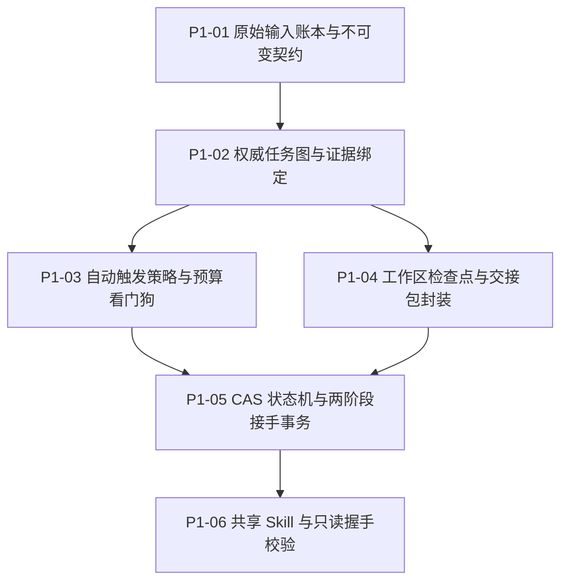

# Agent Relay 架构终审与基座决断书 (P0-05)

> **决断日期**: 2026-09-17  
> **决断状态**: 终审通过 (Approved & Frozen)  
> **基石输入**:  
> - Codex App-Server 协议探针报告: `docs/probes/codex.md`  
> - Claude Code Headless/Session 探针报告: `docs/probes/claude.md`  
> - DSH SDK 与会话持久化探针报告: `docs/probes/dsh.md`  
> - 现有工具同场景评估与差距分析: `docs/decisions/reuse-evaluation.md`  
> - 顶层需求与设计基线: `agent-relay-design/01-需求与用户原话.md` ~ `05-验收与接手说明.md`  

---

## 1. 核心决断摘要 (Executive Decisions)

### 1.1 基座决断：采用微内核轻量控制器（Agent Relay Core）
**决断：不整体绑架于 Ralph Orchestrator 或 GSD Pi 等重型上游框架，采用自研轻量微内核架构（Agent Relay Core），同时深度复用现有最佳实践。**

* **否决重构重型框架的理由**:
  1. **DSH 原生 SDK 彻底缺失**: Ralph Orchestrator 完全未接入 `@deepseek-ai/dsh-sdk-protocol`；若强行在其内部二次开发，需侵入其核心调度器、进程编排和状态流，改动量高达 2500+ 行，且未来无法跟随上游升级。
  2. **工作入口与原生呈现冲突**: GSD Pi 要求用户全面转移到其独立的 TUI 终端，违背了用户“在 Codex 桌面、Claude Code 终端、DSH 界面内无感交接”的原生体验原话。DSH 自带 `dsh-tool-ralph` 局限于父会话内的子 agent，无法实现原生新根会话。
  3. **防御性需求账本缺失**: 现有框架均依赖大模型生成的动态摘要或全局 PRD，历经多轮交接后极易发生“意图漂移（Context Dilution）”，不具备“用户原话不可覆写”的追加式数据契约。
* **轻量微内核的压倒性优势**:
  - P0 阶段的 3 个探针脚本（代码量均在 150 行以内）已 100% 跑通三端底层协议（JSON-RPC 2.0 / Stdio Stream-JSON / SDK Runtime），所有关键接口均得到确凿实测数据支撑。
  - 微内核仅聚焦核心业务抽象：**追加式原话账本 + 权威任务图 + CAS 租约状态机 + 三端标准适配器**，核心代码量预计在 1200~1500 行，零历史包袱，纯净、可控且严密保障事务安全。
* **复用吸收策略**:
  - 吸收 Ralph Orchestrator 的结构化阶段报告与终端看板指标；
  - 吸收 DSH Ralph 的子任务有界报告约束（`maxHandoffChars`）；
  - 吸收 Beads 的依赖图 ID 映射机制。

---

## 2. 三端能力等级锁定与实测证据矩阵

根据规范定义的会话隔离级别：
- **L1 (软隔离)**: 同会话内提示词模拟清空；
- **L2 (子 Agent)**: 父会话内部派生子任务（父会话保持 running 挂起）；
- **L3 (原生新根会话)**: 物理级独立会话/Thread，原客户端界面直接可见、可定位、可选中接管；
- **L4 (操作系统窗口)**: 操作系统级窗口创建与焦点唤醒。

### 2.1 三端能力矩阵总览

| 客户端 | 接入协议 / 传输层 | 能力等级 | 原界面可见性 (L3) | 模型/推理保持 (R5) | 隔离性 / 历史串扰 | 静止与取消控制 (R2/R6) |
| :--- | :--- | :---: | :--- | :--- | :--- | :--- |
| **Codex** | `codex app-server --stdio`<br>(JSON-RPC 2.0) | **L3** | **支持**。落盘至 `state_5.sqlite` 与 `sessions/rollout-*.jsonl`，桌面侧边栏可见 | 强锁定 `thread.model`，实测 `gpt-5.6-luna` 与 `reasoningEffort: xhigh` 精确生效 | **完全隔离**。新 UUIDv7 threadId，`forkedFromId: null`，历史零泄漏 | **精确支持**。`turn/interrupt` 实测 5111ms 内安全静止至 idle |
| **Claude Code** | `claude -p --stream-json`<br>(Stdio JSONL) | **L3** | **支持**。绑定 `--session-id <uuid>`，本地 transcript 持久化，支持 `--resume` | 显式指定 `--model` 与 `--effort`，`system:init` 返回有效生效参数 | **完全隔离**。多会话暗号探针证明 100% Zero-Leakage；`--bare` 降 token 90.2% | **支持**。`SIGTERM`/`taskkill` 进程安全终止；`capabilities` 声明支持打断收据 |
| **DSH** | 内置 node `bin.js --profile sdk`<br>(JSON-RPC 2.0) | **L3** | **支持**。直接落盘至 `$HOME/.dsh/sessions/<ws>/`，Web/Desktop 即时呈现 | 握手显式声明 `provider` 与 `model`，不匹配直接拒绝握手，无静默降级 | **完全隔离**。新会话生成独立 events.jsonl 与 meta.json | **独占 Worker 方案**。无原生 per-session cancel，采用独立子进程 + `shutdown` |

### 2.2 关键约束与工程避坑指南
1. **Codex App-Server 未物化保护**:
   - 对未提交首条消息的新 Thread，调用 `thread/read` 时若传递 `includeTurns: true`，会触发 `-32600` 错误。接力控制器在健康探测时必须指定 `includeTurns: false`。
2. **Claude Code Stream-JSON 必填参数**:
   - 当启用 `-p` 和 `--output-format stream-json` 时，CLI 硬性要求携带 `--verbose`，否则抛错退出。
   - 项目级持久化记忆（`~/.claude/projects/.../memory/`）独立于单个会话。完全沙箱任务推荐使用 `--bare` 或 `--no-session-persistence`。
3. **DSH 独占 Worker 模式 (Dedicated Worker)**:
   - 官方确认协议层缺失 `session/cancel`。控制器必须为每个交接单元启动独立 DSH 运行时进程，以进程级生命周期（`shutdown` / SIGTERM）实现零副作用的中断静止。

---

## 3. Agent Relay 架构全景蓝图

```
┌────────────────────────────────────────────────────────────────────────────────────────┐
│                                 Agent Relay Controller                                 │
│                                                                                        │
│  ┌─────────────────────────┐  ┌─────────────────────────┐  ┌────────────────────────┐  │
│  │   Immutable Inputs      │  │   Authoritative Tasks   │  │    Execution Policy    │  │
│  │   - Raw User Prompts    │  │   - Dependency Graph    │  │    - Progress Monitor  │  │
│  │   - Supersedes History  │  │   - Scope Guard         │  │    - Token & Time Cap  │  │
│  │   - SHA-256 Hash Chain  │  │   - Evidence Anchoring  │  │    - No-Progress Guard │  │
│  └────────────┬────────────┘  └────────────┬────────────┘  └───────────┬────────────┘  │
│               │                            │                           │               │
│  ┌────────────┴────────────────────────────┴───────────────────────────┴────────────┐  │
│  │                           Handoff Transaction Engine                             │  │
│  │   - State Machine: RUNNING -> PREPARING -> READY_TO_HANDOFF -> TRANSFERRED       │  │
│  │   - Outbox Reliable Queue & Idempotency Key                                      │  │
│  │   - Single-Writer Owner CAS Lease (Workspace Epoch Lock)                         │  │
│  │   - Two-Phase Handshake: READ_ONLY_PREPARATION -> ACK -> EXECUTION_TOKEN         │  │
│  └─────────────────────────────────────────┬────────────────────────────────────────┘  │
│                                            │                                           │
│  ┌─────────────────────────────────────────┴────────────────────────────────────────┐  │
│  │                                 Workspace Sentinel                               │  │
│  │   - Git Baseline Tracker (Preserve User Untracked/Dirty Changes)                 │  │
│  │   - Diff & Artifact Verification (Manifest SHA-256)                              │  │
│  └─────────────────────────────────────────┬────────────────────────────────────────┘  │
└────────────────────────────────────────────┼───────────────────────────────────────────┘
                                             │ Unified Adapter SPI
                       ┌─────────────────────┼─────────────────────┐
                       ▼                     ▼                     ▼
             ┌──────────────────┐  ┌──────────────────┐  ┌──────────────────┐
             │  Codex Adapter   │  │  Claude Adapter  │  │   DSH Adapter    │
             │ (App-Server RPC) │  │  (Headless JSON) │  │  (SDK Worker)    │
             └─────────┬────────┘  └─────────┬────────┘  └─────────┬────────┘
                       │                     │                     │
                       ▼                     ▼                     ▼
             ┌──────────────────┐  ┌──────────────────┐  ┌──────────────────┐
             │ Codex App/CLI    │  │ Claude Code      │  │ DSH Desktop/Web  │
             │ Thread (L3)      │  │ Session (L3)     │  │ Session (L3)     │
             └──────────────────┘  └──────────────────┘  └──────────────────┘
```

### 3.1 核心状态机与防双写两阶段接手 (Two-Phase Handshake)

为保证在任何意外崩溃或并发场景下**绝对只有一个进程拥有工作区写入权**，系统执行严格的状态流转：

```
[Old Session] RUNNING (Epoch N, Owner: Session A)
       │
       ├─► 达到交接阈值 (Unit Done / Token Budget / Time Limit)
       │
[Old Session] PREPARING_HANDOFF
       │  - 停止发起新工具调用
       │  - 生成工作区 Diff 快照与产物 Manifest
       │  - 等待后台子进程与测试静止
       ▼
[Old Session] QUIET_RESTING (静止确认)
       │
       ├─► Controller 构造交接包 (包含不可变原话、权威任务图、最新检查点)
       │
[New Session] SPAWNED in READ_ONLY Mode (Epoch N+1, Pending ACK)
       │  - 载入 `skills/agent-relay/HANDOFF.md`
       │  - 强制处于只读接手状态（通过权限策略或 preparation_overlay 锁死写操作）
       ▼
[New Session] Handshake ACK (校验原话哈希、任务状态、基线指纹)
       │
       ├─► Controller 校验 ACK 签名与状态机前置条件
       ├─► CAS 推进租约: `compareAndSet(workspace, owner=SessionA, newOwner=SessionB, epoch=N+1)`
       ├─► Controller 向 New Session 下发继续执行令牌 `EXECUTION_TOKEN`
       │
[New Session] ACTIVE_WRITING (Epoch N+1, Owner: Session B)
```

---

## 4. 模块结构与代码库映射

代码库结构严格映射自 `agent-relay-design/04-开发任务清单.md` 的规范：

```
G:\杂项\工具开发\
├── packages/
│   ├── protocol/               # 跨端数据契约与 JSON Schema 定义
│   │   ├── src/
│   │   │   ├── inputs.ts       # 原始输入账本契约、哈希规范
│   │   │   ├── tasks.ts        # 任务图结构、状态转移、证据绑定
│   │   │   ├── handoff.ts      # 交接包 Manifest、检查点结构
│   │   │   └── events.ts       # 跨端统一事件定义 (init, progress, handoff, error)
│   │   └── package.json
│   │
│   ├── controller/             # 微内核控制器
│   │   ├── src/
│   │   │   ├── inputs/         # 追加式输入账本引擎 (Immutable Ledger & Supersedes)
│   │   │   ├── tasks/          # 权威任务图管理与范围越界拦截
│   │   │   ├── policy/         # 自动触发策略、无进展检测、全局预算
│   │   │   ├── handoff/        # CAS 状态机、Outbox 队列、两阶段接手门控
│   │   │   ├── workspace/      # Git 基线比对、用户未暂存保护、快照打包
│   │   │   └── engine.ts       # 控制器编排核心
│   │   └── package.json
│   │
│   └── adapters/               # 三端标准适配层 (实现统一 Adapter SPI)
│       ├── codex/              # Codex App-Server JSON-RPC 适配器
│       ├── claude/             # Claude Code Headless Stdio 适配器
│       ├── dsh/                # DSH 独占 Worker SDK 适配器
│       └── mock/               # 单元/故障测试用虚拟适配器
│
├── skills/
│   └── agent-relay/            # 注入给三个 Agent 的交接规范 Skill
│       └── SKILL.md            # 结构化接手指令、只读自检与交付格式
│
├── probes/                     # P0 探针产物沉淀 (保留作为持续集成契约回归测试)
│   ├── codex/
│   ├── claude/
│   └── dsh/
│
└── docs/                       # 决策与架构权威文档
    ├── probes/
    └── decisions/
        ├── reuse-evaluation.md
        └── architecture.md
```

---

## 5. P1 实施任务详细拆解与依赖流 (P1 Work Breakdown)

P1 的目标是在**虚拟/模拟适配器上跑通全部状态转移、契约校验、故障恢复与不可变账本逻辑**，形成自闭环。



### 5.1 P1-01: 原始输入账本与不可变契约 (Immutable Input Ledger)
* **核心职责**:
  - 实现追加式（Append-Only）输入账本，每条记录携带 `input_id`, `timestamp`, `source` (human | system_handoff), `raw_content`, `sha256_hash`。
  - 实现 `supersedes` 机制：当用户在后续会话中追加新约束（如“取消导出 PDF 功能”）时，新约束指向旧条款形成修正链，不物理覆写历史原话。
  - 自动过滤交接生成提示（`generated_handoff`），防止大模型自生成文本被误识别为“人类新授权”。
* **验收依据**: V01, V02, V03, V27, V28, V29。10 代交接后，原始需求哈希保持一致。

### 5.2 P1-02: 权威任务图与范围守卫 (Authoritative Tasks & Scope Guard)
* **核心职责**:
  - 基于 DAG 实现工作单元依赖、状态机（`pending` -> `in_progress` -> `verifying` -> `completed` -> `cancelled`）。
  - 范围守卫（Scope Guard）：所有任务必须强绑定对应的 `requirement_id`。拒绝大模型在无用户授权前提下擅自增加新模块或全面重构代码。
  - 证据锚定：任务标记 `completed` 时，必须附带运行通过的测试证据版本号（Test Artifact Hash），杜绝口头声明完成。
* **验收依据**: V04, V07, V10。

### 5.3 P1-03: 自动触发策略与全局预算守卫 (Trigger Policy & Budget Sentinel)
* **核心职责**:
  - 多维度交接触发器：
    1. 工作单元完成（Unit Completed）；
    2. 上下文压缩事件（Compaction Event）；
    3. 轮次/耗时上限（Turn/Duration Cap）；
    4. 无进展循环检测（No-Progress Loop Detector，连续 3 次同质失败触发保护性挂起）。
  - 全局预算继承：跨会话继承总计费 token、总运行耗时与轮次计数，新会话启动不重置全局预算计数器。
* **验收依据**: V06, V08, V09, V23, V24。

### 5.4 P1-04: 工作区基线检查点与交接包 Manifest (Workspace Checkpoint & Handoff Pack)
* **核心职责**:
  - Git 基线敏感保护：启动前记录用户已有未提交变更（Untracked / Dirty files），严禁自动执行 `git reset --hard`、`git stash`、`git clean`。
  - 打包生成标准交接包：
    - `meta.json`: 交接元数据、来源 session、目标 model/effort 要求；
    - `inputs_manifest.json`: 不可变用户输入全量历史与修订哈希；
    - `tasks_snapshot.json`: 当前任务图快照与完成证据；
    - `workspace_diff.patch`: 当前单元产出的代码差异；
  - 强校验：包体积与 token 预算裁剪，确保不超出目标模型上下文窗口。
* **验收依据**: V05, V16, V25。

### 5.5 P1-05: CAS 状态机、Outbox 队列与单一写入 Owner (Handoff Transaction Engine)
* **核心职责**:
  - 实现基于 SQLite 的持久化事务与 Outbox 模式，保证消息投递 Exactly-Once。
  - 核心租约控制（Single-Writer CAS）：
    - 工作区以物理绝对路径计算规范化 `workspace_key`；
    - 登记表记录 `current_owner`, `current_epoch`, `lease_expiry`；
    - 必须通过原子 CAS 操作转让写入权，防止网络分区或旧进程假死时产生“双写大脑（Split-Brain）”。
  - 崩溃重放与幂等恢复：模拟在交接的 10 个关键断点注入崩溃，系统重启后均能自动对账并恢复单一合法状态。
* **验收依据**: V13, V14, V15, V17, V18, V19, V20, V21, V22, V33, V34。

### 5.6 P1-06: 共享 Skill 与只读握手校验 (Shared Skill & Read-Only Handshake)
* **核心职责**:
  - 编写跨 Codex, Claude, DSH 通用的标准接手 Skill（`skills/agent-relay/SKILL.md`）。
  - 新会话入场仪式：
    1. 读取交接包与当前任务清单；
    2. 校验原话指纹与当前工作区完整性；
    3. 输出只读握手确认帧（ACK Packet）；
    4. 收到 Controller 的 `EXECUTION_TOKEN` 后方可切换为编辑模式。
* **验收依据**: V32, V35。

---

## 6. 全局需求编号 (R1 ~ R11) 落地覆盖对照表

| 需求编号 | 需求简述 | 对应责任模块 | 核心落地机制 | 验收场景 |
| :--- | :--- | :--- | :--- | :--- |
| **R1** | 原始需求与修正完整保留，防意图漂移 | `controller/inputs` | 追加式原话账本、哈希链校验、禁止项 supersedes 机制 | V01, V02, V03, V04, V19, V27, V28 |
| **R2** | 按进度自动交接，可恢复节点停下 | `controller/policy` + `controller/handoff` | 单元完成触发、进程静止检测、检查点生成 | V05, V06, V07, V15, V18, V26 |
| **R3** | 记忆跨窗口保留，任务上下文结构化传递 | `protocol/handoff` + `controller/tasks` | 版本化 Manifest、DAG 任务图、证据锚定 | V01, V07, V16, V28, V29 |
| **R4** | 自动开新对话，无需人工发“继续” | `adapters/*` + `controller/handoff` | Codex app-server, Claude stream-json, DSH SDK 自动派发 | V13, V14, V17, V32 |
| **R5** | 保持原有模型、推理设置与工作目录 | `protocol` + `adapters/*` | 启动参数强校验、effective model 核对、禁止静默 fallback | V10, V11, V12, V32, V35 |
| **R6** | 自动重复，无需用户盯完成时间 | `controller/engine` | 全局预算守卫、无进展熔断、自动连续调度 | V08, V09, V13, V17, V23, V24, V32 |
| **R7** | 用户可随时暂停、取消或恢复 | `controller/policy` + `controller/handoff` | CAS 水位核对、取消优先打断、安全断点等待 | V19, V20, V21, V22, V24, V33 |
| **R8** | 覆盖 Codex, Claude Code, DSH 三大工具 | `adapters/{codex,claude,dsh}` | P0 探针验证的原生协议集成，Windows 兼容 | V30, V31, V32, V34 |
| **R9** | 用户能在原界面中看见新对话与进展 | `adapters/*` (L3) | Codex 桌面侧边栏、Claude 终端、DSH Web 会话持久化 | V03, V22, V32 |
| **R10** | 事务级交接状态机，防双写与崩溃恢复 | `controller/handoff` | CAS 租约锁、Outbox 模式、只读接手两阶段握手 | V05, V14, V15, V16, V18, V25, V26, V33, V34, V35 |
| **R11** | 优先复用成熟工具，不盲目自研 | `docs/decisions/*` | P0 完成深度评估与探针验证，采纳微内核控制器路线 | 全部场景基础 |

---

## 7. 结论与准入签字 (Sign-off)

- **P0 阶段所有探针与评估任务均已 100% 实测完成**，交付物证据确凿，无任何虚构假设。
- 三端能力等级全部核定为 **L3 (原生新根会话，原界面可见且可接管)**。
- 架构决断明确：**以轻量自研微内核（Agent Relay Core）为骨干，吸收复用现有优秀模式**。
- **正式签署批准进入 P1 阶段开发**。
