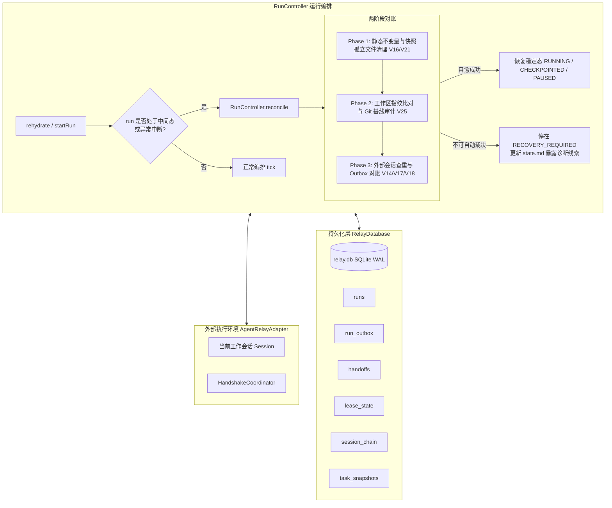

# P3-01 崩溃、掉线与部分任务恢复设计规范 (Crash, Offline & Partial Recovery)

- **版本**: v1.0
- **日期**: 2026-09-19
- **状态**: 提案已确认，待规划实现
- **对应清单**: `agent-relay-design/04-开发任务清单.md` §6.1 (P3-01)
- **覆盖需求**: R2 (进度节点), R6 (自动连续), R7 (停/续/离开), R10 (故障恢复)
- **覆盖验收场景**: V07, V14, V16, V17, V18, V25, V26, V33

---

## 1. 目标与设计原则

在长任务多轮接力过程中，物理环境可能在任意时刻发生异常：主控进程被强杀、电源掉电、网络中断、模型服务端返回超时、用户在后台交接时编辑文件或切换 Git 分支、单元构建测试失败等。

P3-01 的核心目标是：构建**完备的崩溃故障恢复机制与两阶段对账器（Two-Phase Reconciler）**，扩展持久化发信箱（`run_outbox`），并实现**跨全状态机边界的精确故障注入验证套件（Fault Injection Suite）**。

### 核心设计原则 (Guiding Principles)
1. **不覆盖用户修改 (Preserve User Modifications, V25)**：工作区指纹一旦与基线失配（检测到外部代码编辑、未跟踪文件、Git 分支切换或 Rebase），立即停止发放写令牌并转入 `RECOVERY_REQUIRED`，绝对禁止自动执行 `git reset --hard` 或 `git stash` 掩盖差异。
2. **不重复外部动作 (At-Most-Once External Side Effects, V14/V26)**：对外部不可逆动作（部署、付款、发布或长耗时作业）超时或未知结果时，记录部分状态并安全停住，绝不盲目重放。
3. **不把部分完成当完成 (Accurate Partial State, V07)**：单元失败但非崩溃时，任务保持 `in_progress` 并固化失败证据，下一轮接手根据诊断线索继续，严禁伪报完成。
4. **不确定状态清晰停住 (Explicit Halting on Ambiguity, V18)**：旧会话静止无法确认、租约状态存在竞态风险时，拒绝盲目接管，在 `RECOVERY_REQUIRED` 清晰停住。
5. **可幂等自愈断点自动推进 (Deterministic Forward Recovery, V16/V17)**：孤立半写文件安全清理回滚至完整快照；已 ACK 但令牌未送达的交接在重启时补发相同 epoch 的可去重令牌，不重复创建 worker。

---

## 2. 架构概览与系统交互



---

## 3. 权威存储扩展：Durable Outbox (`run_outbox`)

为防止会话创建与令牌派发过程中因进程崩溃出现“外部已创建但主控无记录”或“主控重试导致重复创建多个僵尸会话”，在 `RelayDatabase` 中引入持久化发信箱。

### 3.1 SQLite Schema 迁移

在 `packages/controller/src/run/db.ts` 追加迁移：

```sql
CREATE TABLE IF NOT EXISTS run_outbox (
  msg_id            TEXT PRIMARY KEY,
  run_id            TEXT NOT NULL,
  handoff_id        TEXT,
  topic             TEXT NOT NULL, -- 'create_session' | 'authorize_execution' | 'interrupt_session'
  target_session_id TEXT,
  payload           TEXT NOT NULL DEFAULT '{}',
  state             TEXT NOT NULL, -- 'PENDING' | 'DISPATCHED' | 'ACKED' | 'FAILED'
  attempts          INTEGER NOT NULL DEFAULT 0,
  last_error        TEXT,
  created_at        INTEGER NOT NULL,
  updated_at        INTEGER NOT NULL
);

CREATE INDEX IF NOT EXISTS idx_outbox_run ON run_outbox(run_id, state);
CREATE INDEX IF NOT EXISTS idx_outbox_handoff ON run_outbox(handoff_id);
```

### 3.2 发信箱数据访问接口 (`RunStore`)

```typescript
export interface OutboxRow {
  msgId: string;
  runId: string;
  handoffId: string | null;
  topic: string;
  targetSessionId: string | null;
  payload: string;
  state: 'PENDING' | 'DISPATCHED' | 'ACKED' | 'FAILED';
  attempts: number;
  lastError: string | null;
  createdAt: number;
  updatedAt: number;
}

export interface EnqueueOutboxInput {
  msgId?: string;
  runId: string;
  handoffId?: string;
  topic: string;
  targetSessionId?: string;
  payload?: Record<string, unknown>;
}

export class RunStore {
  // ... 现有方法
  public enqueueOutbox(input: EnqueueOutboxInput): OutboxRow;
  public updateOutboxState(msgId: string, state: OutboxRow['state'], options?: { lastError?: string; incrementAttempts?: boolean }): void;
  public getOutbox(msgId: string): OutboxRow | undefined;
  public findOutboxByHandoff(handoffId: string, topic: string): OutboxRow | undefined;
  public listPendingOutbox(runId: string): OutboxRow[];
}
```

---

## 4. 两阶段对账与自愈机制 (`RunController.reconcile`)

当 `rehydrate(runId)` 载入一个非终态运行，或者编排循环中遇到交接中间态（`DRAINING` / `CHECKPOINTED` / `STARTING` / `PREPARING` / `READY`）及 `RECOVERY_REQUIRED` 时，触发 `reconcile()`。

### 4.1 对账三阶段执行流

```typescript
export interface ReconcileResult {
  recoveredState: RunState;
  healedActions: string[];
  requiresManualIntervention: boolean;
  reason?: string;
  discrepancyDetails?: Record<string, unknown>;
}
```

#### Phase 1: 静态不变量核对与孤立快照清理 (V16, V21)
1. **未完成快照清理 (V16)**：
   - 扫描 `<dataDir>/<runId>/handoffs/` 目录：
   - 遍历各 handoff 文件夹中的 `manifest.json`：
     - 若磁盘文件存在，但 SQLite `handoffs` 表中无记录，或 `handoffs.state === 'REQUESTED'`（尚未提交 `SNAPSHOTTED`），或实际文件 SHA-256 与 `handoffs.manifest_hash` 不符（写到一半损坏）：
     - 判定该快照为崩溃产生的孤立/半写损坏快照；
     - 主控执行清理动作：删除不完整的 `manifest.json`，将 handoff 状态重置或标记为 `ABANDONED`；
     - 确保后继会话绝不会读取到半写文件，回滚到上一个完整的任务图快照。
2. **意图与挂起优先守卫 (V21)**：
   - 查询 `ControlIntentLog` 中最新的未消费意图；
   - 若存在未消费的 `stop_now`：即便控制器之前发生崩溃，也绝不能将其误判为正常续跑，强制转入 `CANCELLED` 并记录自愈动作；
   - 若处于 `PAUSED` 态且无 `resume` 意图：保持 `PAUSED` 并不发起新的交接。

#### Phase 2: 工作区完整性比对 (V25)
1. **工作区指纹核验 (V25)**：
   - 调用 `sentinel.captureFingerprint()` 获取当前工作区指纹 `currentFp`；
   - 与最近一次合法提交的快照中的 `workspaceFingerprint`（`baselineFp`）进行全维度比对：
     - **HEAD Commit 比对**：若 `currentFp.commitHash !== baselineFp.commitHash`，判定用户中途执行了切换分支、检出历史 commit 或 rebase；
     - **未跟踪文件与受保护文件比对**：若基线中的必要文件被删除，或者工作区出现了预期任务产物之外的未跟踪文件与脏修改（`dirtyFiles`）；
2. **严格防御阻断**：
   - 若比对失败：
     - 将 run 状态标记为 `RECOVERY_REQUIRED`；
     - `blockedReason` 明确设置为 `workspace_fingerprint_mismatch`；
     - 记录结构化事件 `workspace_mismatch_detected`，并在状态卡（`state.md`）渲染出预期的 Git Commit vs 实际 Git Commit，以及被修改/新增的文件清单；
     - **绝不执行 `git reset --hard` 或 `git stash`，绝对保留用户现场**。

#### Phase 3: 外部会话与发信箱对账 (V14, V17, V18)
1. **创建会话响应丢失的查重自愈 (V14)**：
   - 检查 `run_outbox` 中关于当前交接的 `create_session` 记录：
   - 若消息处于 `PENDING` 或 `DISPATCHED`，但对应 handoff 停在 `CREATING/PREPARING`：
     - 调用 `adapter.hasSession(targetSessionId)` 或 `listSessions()` 进行反查；
     - **情况 A（会话已存在且健康）**：说明服务端已成功创建，仅因当时主控崩溃未拿到回包。主控更新发信箱为 `DISPATCHED`，直接绑定该 `targetSessionId` 进入 ACK 解析与核对阶段，**杜绝重复调用适配器创建孤立僵尸会话**；
     - **情况 B（会话不存在且外部明确确认）**：发信箱标记为重试，重新发起创建；
     - **情况 C（外部无法确认或网络持续超时）**：阻断于 `RECOVERY_REQUIRED`（`blockedReason: 'session_creation_ambiguous'`），不盲目重建。
2. **已 ACK 令牌未送达的幂等补发 (V17)**：
   - 若 `handoffs.state === 'AUTHORIZED'`，且新会话已经完成只读 ACK，但 session_chain 尚未追加成功（即崩溃发生在步骤 7 CAS 提交后、步骤 8 令牌投递完成前）：
   - 从 `handoffs` 与 `store.getAuthorization(runId)` 读取已确定的授权 epoch；
   - 调用 `adapter.authorizeExecution(toSessionId, epoch, executionToken)` 进行**幂等重新投递**；
   - 令牌投递成功后，补齐 `session_chain` 追加并标记 `handoffs.state = 'COMPLETED'`，转入 `RUNNING` 态，**不重新生成任务，不重置执行单元计数**。
3. **旧会话僵死/失联防护 (V18)**：
   - 若交接停留在 `DRAINING` 阶段，主控重启后不凭租约过期强行转让写权；
   - 重新向旧会话下发 `interruptOwned()`，并执行带超时的 `awaitQuiescence()`；
   - 若旧会话依然无法确认静止，状态转移至 `RECOVERY_REQUIRED`（`blockedReason: 'old_session_quiescence_unconfirmed'`），绝不启动新写入者。

---

## 5. 异常执行边界规范

### 5.1 部分任务失败检查点 (V07)
- 当执行单元测试未通过或命令报错时：
  - 任务图状态保持为 `in_progress`，**绝不标记为 completed**；
  - 抓取失败命令的 stdout/stderr 错误输出，提取失败签名（`signature`）；
  - 将错误详情完整写入工作区交接包中的 `resume.md` 与快照，注明“该任务处于部分完成态，下一会话应先诊断修复，无需重头执行前期已通过步骤”。

### 5.2 长期作业与外部写操作超时 (V26)
- 对于长时间运行的外部作业（编译/模型微调等）：
  - 记录其作业 PID/进程树标识与日志落盘路径；
  - 若交接时作业尚未结束且无法跨会话安全接管，主控进入静止等待或提示用户暂停，**禁止伪报完成**。
- 对于外部不可逆动作（部署发布、数据库迁移）发生网络超时导致结果未知：
  - 控制器转入 `RECOVERY_REQUIRED`（`blockedReason: 'external_action_outcome_unknown'`）；
  - **重启后绝不盲目重放该写操作**，必须由人工通过 CLI 或外部探针查明实际状态后再放行。

### 5.3 授权边界并发取消与修订 (V33)
- **在 owner CAS 之后、令牌消费前**收到 `stop_now`：
  - 立即递增租约 `epoch`，使刚下发的令牌自动作废；
  - 新会话因只读门控未解禁，无法对工作区造成破坏；
  - 经由 `interruptOwned()` 确认静止后进入 `CANCELLED`。
- **在令牌消费后**收到 `stop_now`：
  - 立即下发中断，等待静止后记录未确认部分状态，无法静止则进入 `RECOVERY_REQUIRED`。

---

## 6. 故障注入测试挂钩架构 (Fault Injection Harness)

为支撑自动化回归测试，`RunControllerOptions` 增加无侵入测试钩子。生产环境下 `faultHook` 为 `undefined`，零开销。

### 6.1 故障注入点定义

```typescript
export type FaultInjectionPoint =
  | 'before_intent_record'
  | 'after_intent_record'
  | 'before_old_drain'
  | 'after_old_quiescence'
  | 'during_snapshot_write'          // 模拟快照写到一半断电损坏 (V16)
  | 'after_snapshot_file_written'    // 模拟快照文件已写完但数据库事务未提交 (孤立文件 V16)
  | 'after_db_publish'
  | 'before_session_create_call'     // outbox 记录已写入，但尚未调用适配器 (V14)
  | 'session_create_response_lost'   // 适配器已创建新会话，但引擎在收到响应前崩溃 (V14)
  | 'during_readonly_prep'           // 只读准备执行中崩溃
  | 'after_ack_received'             // ACK 已收到，但 CAS 事务前崩溃
  | 'after_owner_cas'                // CAS 租约已转让，但继续令牌投递前崩溃 (V17)
  | 'after_token_dispatch'           // 令牌已发出，但首个写操作前崩溃
  | 'during_first_write';

export interface FaultContext {
  runId: string;
  handoffId?: string;
  sessionId?: string;
  epoch?: number;
  stage?: string;
  metadata?: Record<string, unknown>;
}

export type FaultHook = (point: FaultInjectionPoint, context: FaultContext) => Promise<void> | void;
```

### 6.2 验收测试套件规划 (`tests/recovery/`)

1. `tests/recovery/snapshot-crash.test.ts`
   - **V16**: 在快照写入期间注入崩溃（生成半截/损坏的 `manifest.json`），或快照已写完但数据库未记录（孤立文件）。验证 `reconcile()` 启动后安全清除损坏孤立快照，恢复至最近合法快照。
2. `tests/recovery/outbox-reconcile.test.ts`
   - **V14**: 在 `session_create_response_lost` 注入崩溃。验证 `reconcile()` 查出 outbox 待对账会话，通过适配器匹配到已存在的会话，避免重复创建孤立 worker。
   - **V17**: 在 `after_owner_cas` 注入崩溃。验证 `reconcile()` 识别 `AUTHORIZED` 状态，只重投幂等执行令牌，不重复创建 worker，随后顺利推进至 `RUNNING`。
3. `tests/recovery/workspace-recovery.test.ts`
   - **V25**: 在交接或恢复期间，模拟外部 `git checkout` 切换分支、新增冲突文件或删除受控文件。验证 `reconcile()` 侦测到 `WorkspaceFingerprint` 失配，安全转入 `RECOVERY_REQUIRED` 并列出详细差异，绝不执行 `git reset --hard` 或 `git stash` 破坏用户代码。
4. `tests/recovery/crash-recovery.test.ts`
   - **V18**: 模拟旧 worker 进程挂起，静止检查超时。验证系统不凭租约过期强行转让写权，阻止新会话启动。
   - **V33**: 在 CAS 转让后、令牌消费前注入取消。验证令牌作废，新会话维持只读并被清理。
   - **V21**: 控制器关闭或停止后重启，验证 `CANCELLED` 或 `PAUSED` 状态无损保持。
5. `tests/recovery/partial-tasks.test.ts`
   - **V07**: 单元执行失败，测试报错。验证任务维持 `in_progress`，记录失败证据与输出，交接包包含正确诊断建议。
   - **V26**: 长作业未完成或外部发布超时。验证系统标记未决状态，不伪报完成，不重复重试外部动作。

---

## 7. 机械不变量核验规则 (Post-Recovery Invariants)

恢复套件中的每个测试用例必须对以下 5 条机械不变量进行自动化断言：
1. **Single Writer**: `lease_state` 的 `current_owner` 必须唯一，且必须对应于一个有效且未被 `superseded` 的活跃会话。
2. **Verbatim Hash Stability**: 重启对账后，`inputLedgerHeadHash` 与 `taskSnapshotHash` 与崩溃前记录的哈希完全一致。
3. **Zero User Data Loss**: 工作区未跟踪文件与已有文件内容哈希必须与外部修改一致，未被强行回滚或清除。
4. **At-Most-Once Completion**: 任务完成次数、外部通知调用次数、会话链有效执行次数严格单调不回退，不发生重复执行。
5. **Intent Primacy**: 用户下达的 `stop_now` / `pause_next_node` 优先级永远高于自动续跑，不因重启被静默消除。
