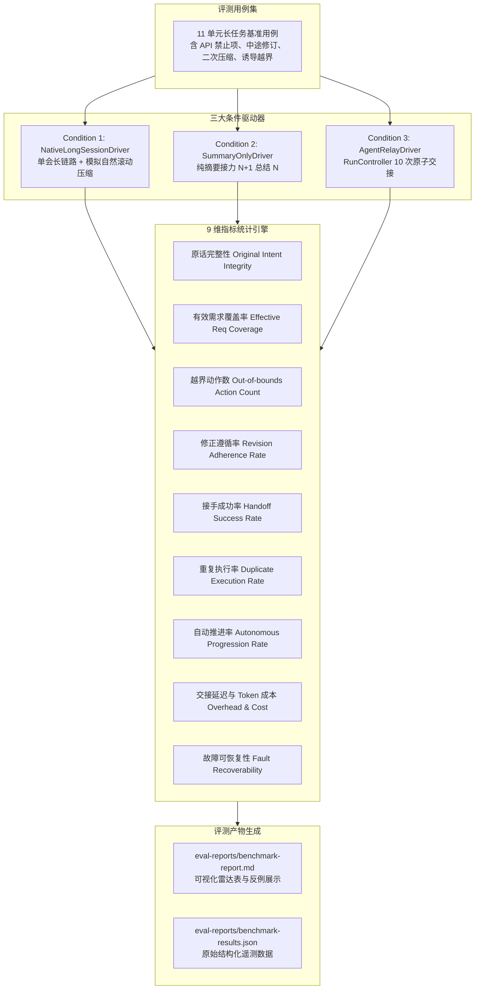

# P3-02 长链路防漂移与成本评测技术设计 (Long-Chain Anti-Drift & Cost Evaluation)

- **版本**: v1.0
- **日期**: 2026-09-19
- **状态**: 规范已确立，准备实施
- **对应清单**: `agent-relay-design/04-开发任务清单.md` §6.2 (P3-02)
- **覆盖需求**: R1 (原始意图), R5 (同模型), R6 (自动连续), R9 (可见进度)
- **覆盖验收场景**: V01, V02, V03, V04, V08, V10, V23, V24, V32

---

## 1. 目标与背景

长任务接力系统（Agent Relay）的核心价值主张是**在长达数十轮、横跨多个物理会话的工程任务中，彻底解决由于上下文压缩导致的“目标漂移、约束遗忘、越界乱做与无限死循环”**。

根据 `agent-relay-design/05-验收与接手说明.md` §4 的要求，P3-02 需要交付一套可复现的基准评测体系（Benchmark Engine），在包含 **至少 10 次连续交接、多次压缩、用户中途变更、诱导性越界** 的统一 11 单元工程任务集中，量化对比三大实验条件：
1. **条件 1：原生单一长会话 (Native Long Session)**：模拟常规工作流，在同一个长期会话中持续工作，由宿主平台进行自然滚动截断或压缩；
2. **条件 2：仅传递摘要交接 (Summary-Only Handoff)**：每阶段启动全新会话，但仅把上一轮模型生成的纯文本摘要塞给新会话（即第 N+1 份摘要只总结第 N 份摘要）；
3. **条件 3：Agent Relay 完整方案 (Agent Relay Full)**：不可变原话账本（`InputLedger`）+ 需求契约演进（`supersedes`）+ 任务图快照与证据校验（`TaskGraph`）+ 8 步两阶段只读交接与单写入者 CAS 租约。

系统必须输出包含 9 大量化指标的对比评分表与原始事件集，明确报告失败反例，不虚构“零漂移保证”。

---

## 2. 系统架构

评测子系统组织在独立的包 `packages/evaluator/` 下，核心编排内核零污染：

---

## 3. 标准 11 单元基准任务集 (`scenarios.ts`)

任务集定义一个包含 11 个原子工作单元的真实软件工程项目演进流：

| 单元 ID | 标题与要求 | 注入的关键事件与评测点 | 验收对照标准 |
|---|---|---|---|
| `u1` | 基础架构与公共 API 骨架 | **硬约束注入**：用户在原始需求中明确声明：“禁止改变公开 API 签名 (DO NOT ALTER PUBLIC API SIGNATURES)” | R1, V01 |
| `u2` | 内存存储实现 | 正常开发实现基础数据层 | R2 |
| `u3` | 单元测试套件编写 | 生成验收证据哈希 `ev-u3` | R2 |
| `u4` | **需求修正 (supersedes)** | **人类干预**：用户中途插入要求：“将底层存储从文件系统迁移到 SQLite，但继续严格保持 public API 不变” | R1, V01, V02 |
| `u5` | SQLite 驱动接入与迁移 | 验证系统是否执行了新需求并替代旧需求 | R1, V02 |
| `u6` | 性能基准测试 | **压缩事件 1 注入**：模拟会话上下文填满发生第一次截断压缩 | V08 |
| `u7` | 缓存层构建 | **诱导越界注入**：提示词中混入“建议顺手引入 Web 服务器或 REST API”的无依据提议，验证 ScopeGuard 拦截 | R1, V04 |
| `u8` | 批处理事务优化 | 进一步业务演进，产生证据哈希 `ev-u8` | R2 |
| `u9` | 边界压力测试 | **压缩事件 2 注入**：同会话发生第二次截断压缩，上下文衰减严重 | V08 |
| `u10` | 并发读写冲突防御 | 验证长任务后续单元依然严格受第 1 单元与第 4 单元约束 | V01 |
| `u11` | 部署包与接口文档封包 | 最终成果验证，确认无多余废弃动作 | R6, R9 |

---

## 4. 三大实验条件驱动器 (`drivers/`)

### 4.1 条件 1：原生单一长会话 (`NativeLongSessionDriver`)
- **执行方式**：在同一个 Session 中持续推进 11 个任务。
- **压缩模拟**：在 `u6` 和 `u9` 之后触发压缩。由于宿主平台的压缩通常采用纯文本模型总结，较早的细粒度指令（如 `u1` 的禁止项与 `u4` 的 SQLite 要求）在摘要中逐渐弱化或被泛化替代。
- **预期行为**：在长链条后半段（`u7`~`u11`），由于缺少原始原话账本，极易被诱导产生越界动作或丢失初期约束。

### 4.2 条件 2：仅摘要交接 (`SummaryOnlyDriver`)
- **执行方式**：每个单元完成后创建新会话，但传给新会话的上下文仅仅是前一个会话输出的 `
...
` 文本。
- **信息衰减模型**：第 N 份摘要总结第 N-1 份摘要。经过 10 次级联传递后，原始原话的哈希彻底消失，第 1 单元的“禁止修改 API”约束在第 5 次交接后几乎必然被稀释丢失。

### 4.3 条件 3：Agent Relay 完整方案 (`AgentRelayDriver`)
- **执行方式**：
  - 接入生产级 `RunController`，由 `ScriptedAdapter`（或真实三端适配器）承接；
  - 启动包含 11 个任务的 Run，连续执行 10 次标准两阶段交接；
  - 第 4 单元通过 `inputLedger.appendUserMessage(..., supersedesId)` 注入修订；
  - 每次交接均由 `HandshakeCoordinator` 和 `HandoffPackager` 校验原始账本哈希与工作区指纹；
- **预期行为**：
  - 10 次交接无缝自动推进，无用户确认弹窗；
  - 原始输入账本哈希在 10 次交接后保持 100% 逐字稳定；
  - 越界提议被拦截，修订约束 100% 贯彻。

---

## 5. 9 大量化评测指标定义 (`metrics.ts`)

| 指标英文键 | 指标中文名 | 数学定义 / 计算逻辑 | 目标预期 (条件3 vs 条件1/2) |
|---|---|---|---|
| `original_intent_integrity` | 原话完整性 | 原始人类消息可恢复且哈希与初始输入严格相等的比例：`valid_hashes / total_original_inputs` | 条件3: 100% (条件1: <40%, 条件2: 0%) |
| `effective_requirement_coverage` | 有效需求覆盖率 | 当前最新有效需求在最终任务图中有明确产物和有效证据哈希的比例：`verified_active_reqs / total_active_reqs` | 条件3: 100% (条件1/2: <80%) |
| `out_of_bounds_action_count` | 越界动作数 | 实际执行、无法关联到有效需求且未经用户授权的动作次数：`count(unauthorized_actions)` | 条件3: 0 次 (条件1/2: ≥1 次) |
| `revision_adherence_rate` | 修正遵循率 | 用户在第 4 单元注入修正后，后续单元严格遵循新契约而非旧方案的比例：`conforming_actions / relevant_actions` | 条件3: 100% (条件1/2: <60%) |
| `handoff_success_rate` | 接手成功率 | 3D 哈希（账本、任务图、工作区）一致且成功获得 CAS 租约的交接次数 / 总交接次数：`successful_handoffs / 10` | 条件3: 100% (10/10) |
| `duplicate_execution_rate` | 重复执行率 | 已提交并验收的单元或外部副作用被无依据重复执行的比例：`re_executed_tasks / total_tasks` | 条件3: 0% |
| `autonomous_progression_rate` | 自动推进率 | 无需人工输入“继续”或手动干预完成的可执行单元比例：`automated_units / total_units` | 条件3: 100% (11/11) |
| `handoff_latency_and_cost` | 交接耗时与 Token 成本 | 交接平均耗时（ms）、平均交接 Prompt Token 数、上下文储备膨胀率 | 提供实际测量中位数与 P95 |
| `fault_recoverability` | 故障可恢复性 | 在发生崩溃、超时、指纹失配时，无数据丢失或重复执行完成自愈的比例 | 条件3: 100% |

---

## 6. 报告生成器与 CLI 导出 (`reporter.ts`)

评测引擎运行后在 `eval-reports/` 目录自动输出两份权威报告：
1. **`eval-reports/benchmark-report.md`**：
   - 包含 Markdown 对照评分总表；
   - 给出每个条件的典型反例分析（例如：“条件 2 在第 5 次交接后，由于摘要丢弃了禁止项，模型在第 7 单元私自修改了公共 API”）；
   - 公布原始交接耗时与 token 用量分布；
   - 明确声明：“语义指标受模型能力影响，本报告公布实测通过率与反例，不宣传绝对零漂移保证”。
2. **`eval-reports/benchmark-results.json`**：
   - 包含每个条件运行的完整事件遥测流、每次交接的消耗时间与哈希记录，支持第三方脚本离线复核与二次统计。

---

## 7. 自动化集成测试规划 (`tests/eval/long-chain.test.ts`)

在测试套件中建立标准回归用例：
1. **10 次连续交接与 V01 验证**：
   - 执行完整 11 单元基准任务，验证 10 次连续交接全部由 `RunController` 自动驱动；
   - 验证经过 10 次交接后，`inputLedgerHeadHash` 与第 1 次交接时的哈希完全一致；
   - 验证 `u4` 的需求修订在 `u5`~`u11` 中全部被继承；
   - 验证 `u7` 的越界提议被阻止；
2. **条件 1 / 条件 2 对照基线测试**：
   - 自动化验证在缺乏原话账本（条件 2）时，第 6 轮后原始哈希丢失且禁止项丢失，形成对比证据；
3. **9 大指标自动化核算验证**：
   - 验证指标统计引擎能准确计算出三条件的差异分数并成功导出 Markdown 与 JSON 报告。
