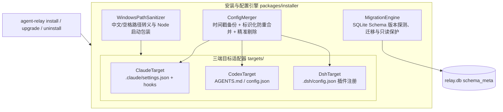

# P3-03 安装、升级、卸载与兼容测试技术设计 (Installation, Upgrade, Uninstallation & Compatibility)

- **版本**: v1.0
- **日期**: 2026-09-20
- **状态**: 规范已确立，准备实施
- **对应清单**: `agent-relay-design/04-开发任务清单.md` §6.3 (P3-03)
- **覆盖需求**: R6 (自动连续), R8 (三端适配)
- **覆盖验收场景**: V05 (安装配置无损合并), V06 (防重注册), V07 (卸载精准回滚与用户数据保留), V25 (跨平台与 Windows 路径兼容)

---

## 1. 目标与背景

长任务接力系统（Agent Relay）需要与不同的宿主智能体环境（Claude Code、Codex CLI、DSH）紧密集成。各宿主环境具有不同的配置文件格式（JSON、Markdown）、存储路径（用户全局主目录、项目局部工作区）以及 Hook 触发机制。

根据 `agent-relay-design/04-开发任务清单.md` §6.3 的要求，P3-03 需交付一套生产级的安装、升级与卸载子系统（`packages/installer`），实现：
1. **三端配置无损合并**：支持 Claude Code（`.claude/settings.json`）、Codex CLI（`AGENTS.md` / `config.json`）、DSH（插件清单与环境配置）。修改前自动生成时间戳备份（`*.bak.<timestamp>`），绝不覆写用户自建配置。
2. **幂等防重注册**：通过在配置对象中注入 `managedBy: "agent-relay"` 标识，重复执行安装命令时原地更新，绝不重复追加 Hook 触发器。
3. **精准卸载与数据保护**：卸载时仅剔除带有 Relay 标识的配置项并还原配置文件；默认严格保留用户生成代码与 `relay.db` 历史，绝不误删用户资产。
4. **Schema 升级与降级保护**：支持数据库 Schema 顺向迁移；当探测到高于当前程序支持的 Schema 版本时，安全降级为只读模式，防止破坏新版数据。
5. **Windows 深度兼容**：原生支持中文路径（如 `G:\杂项\工具开发\`）、空格路径（如 `C:\Program Files\`）及 PowerShell/CMD 引号边界安全转义。

---

## 2. 系统架构

安装子系统作为独立包 `packages/installer/`，通过 CLI 子命令对外提供服务：



---

## 3. 核心模块设计

### 3.1 `ConfigMerger`（无损配置合并器）

- **时间戳备份**：
  在写入或修改任何已有配置文件前，检查其存在性。若存在，在同级目录创建备份文件：
  `<filepath>.bak.<YYYYMMDD-HHMMSS>`。
- **JSON 深度合并与防重（Claude / DSH）**：
  - 对待注入的 Hook 或插件项，显式注入标识属性：`"managedBy": "agent-relay"`；
  - 遍历目标文件既有数组（如 `hooks`），若存在 `managedBy === "agent-relay"` 且事件类型相同的条目，则原地覆盖其命令与参数；
  - 若不存在，则追加至数组尾部；
  - 用户的其他自定义 Hook 和配置字段 100% 原样保留。
- **Markdown 锚点块合并与防重（Codex）**：
  - 在 `AGENTS.md` 中采用固定注释锚点：
    ```markdown
    <!-- AGENT_RELAY_START: managed by agent-relay, do not edit manually -->
    ... Relay 协议指引与配置 ...
    <!-- AGENT_RELAY_END -->
    ```
  - 重复安装时替换锚点内的内容；未找到锚点时追加至文件末尾。
- **卸载精准剥离**：
  - JSON：过滤移除所有 `managedBy === "agent-relay"` 的条目；
  - Markdown：正则剥离锚点块之间的全部内容；
  - 若移除后文件为空且该文件最初是由 Relay 新建的，则安全删除该文件；否则保留已清理的文件。

### 3.2 `WindowsPathSanitizer`（路径与命令行安全转义）

- **路径规范化**：
  - 获取当前激活的 Node.js 可执行文件绝对路径（`process.execPath`）与 CLI 入口脚本绝对路径；
  - 解析绝对物理路径，确保 Windows 盘符（如 `C:`、`G:`）与反斜杠格式正确。
- **空格与中文字符双引号转义**：
  - 当路径中包含空格（`\s`）或中文字符时，命令字符串内部使用受保护的转义双引号包装：
    ```text
    "\"C:\\Program Files\\nodejs\\node.exe\" \"G:\\杂项\\工具开发\\packages\\cli\\dist\\index.js\" hook session_start --workspace \"G:\\杂项\\工具开发\""
    ```
  - 避免 Windows 命令解释器或 PowerShell 在解析带有空格的路径时发生参数截断。

### 3.3 `MigrationEngine`（数据库版本迁移与降级防御）

- **Schema 版本登记**：
  `RelayDatabase` 的 `schema_meta` 表中记录当前版本 `schema_version`（当前为 `"1"`）。
- **迁移序列定义**：
  维护有序的迁移函数字典（如 `v1 -> v2`），升级时按序执行，并在单一事务内完成 DDL 与版本号递增。
- **高版本只读降级**：
  若探测到数据库 `schema_version` 大于当前程序能处理的最大版本（例如数据库为 v2，但运行的是 v1 代码）：
  - 阻止任何写事务执行；
  - 设置 SQLite PRAGMA `query_only = ON`；
  - 抛出明确的结构化异常：`IncompatibleSchemaVersionError(found: X, maxSupported: Y)`。

### 3.4 三端 Target 适配器

1. **`ClaudeTarget`**：
   - 目标路径：
     - 全局：`~/.claude/settings.json`
     - 工作区：`<workspace>/.claude/settings.json`
   - 注入 Hooks：
     - `SessionStart`：自动检测前序交接与初始化；
     - `PreCompact`：捕获上下文压缩前置信号；
     - `Stop`：安全拦截与状态同步。
2. **`CodexTarget`**：
   - 目标路径：
     - 全局：`~/.codex/config.json`
     - 工作区：`<workspace>/AGENTS.md`
   - 注入配置与锚点指引。
3. **`DshTarget`**：
   - 目标路径：
     - 全局：`~/.dsh/plugins/agent-relay/`
     - 工作区：`<workspace>/.dsh/config.json`
   - 注入插件激活清单与工作区映射。

---

## 4. CLI 命令交互设计

在 `packages/cli/src/cli.ts` 中注册三个安装器子命令：

```bash
# 安装
agent-relay install [--target=claude|codex|dsh|all] [--global] [--workspace=<path>]

# 升级
agent-relay upgrade [--workspace=<path>]

# 卸载
agent-relay uninstall [--target=claude|codex|dsh|all] [--global] [--workspace=<path>] [--purge-all]
```

- 默认参数：
  - `target` 缺省为 `all`（安装所有已探测到的宿主或全部三端）；
  - 默认同时注册全局共享配置与当前工作区本地配置；
  - `uninstall` 默认严格保留用户代码与 `relay.db`，仅传 `--purge-all` 时才清理数据文件。

---

## 5. 验收测试计划

1. `tests/installer/merger.test.ts`：
   - 验证备份文件生成格式 `<file>.bak.<timestamp>`；
   - 验证已有自定义 Hook 不受影响；
   - 验证连续执行 3 次 `install` 后 Hook 数组中只包含一条 Relay Hook（防重）；
   - 验证 `uninstall` 能将配置文件还原至无 Relay 状态。
2. `tests/installer/sanitizer.test.ts`：
   - 验证包含空格、中文字符与反斜杠的路径在转义后能正常被解析为独立参数。
3. `tests/installer/migration.test.ts`：
   - 验证 Schema 迁移升级的原子性；
   - 验证检测到未来高版本 Schema 时的只读防御。
4. `tests/installer/e2e-windows.test.ts`：
   - 在真实创建的包含中文和空格的临时目录（如 `temp/测试 目录 with spaces/`）中完成完整的安装、Hook 调用模拟、升级与卸载闭环。
