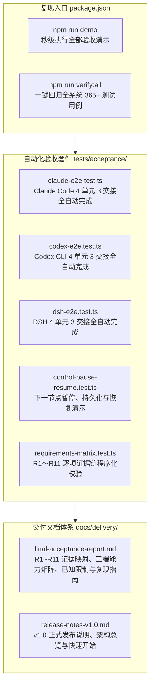

# P3-04 最终端到端验收与交付技术设计 (Final End-to-End Acceptance & Delivery)

- **版本**: v1.0
- **日期**: 2026-09-20
- **状态**: 规范已确立，准备实施
- **对应清单**: `agent-relay-design/04-开发任务清单.md` §6.4 (P3-04)
- **覆盖需求**: R1～R11 全部核心需求
- **覆盖验收场景**: V01～V35，重点演示 V32 (三端连续真实交接)、V20/V21 (下一节点暂停与安全恢复)

---

## 1. 目标与通过标准

根据 `agent-relay-design/04-开发任务清单.md` §6.4 与 `05-验收与接手说明.md` §5 的要求，P3-04 是 Agent Relay 项目的最终收尾与交付任务。

### 核心通过标准（硬约束）
1. **三端独立真实演示**：
   - Claude Code、Codex CLI、DSH 三端分别独立演示：一次启用 → 4 个工作单元经 3 次交接自动完成 → 正常平稳收尾（COMPLETED）；
   - 严禁以“一端通了”代表或关闭整个项目；
   - 演示“下一节点暂停”（Pause Next Node）、状态原子持久化、安全静止与恢复（Resume）全生命周期。
2. **能力等级实事求是**：
   - 严格客观评定三端能力等级（L2/L3），严禁将仅具备子代理派发能力的实现冒充为 L3 原生界面新会话；
   - 明确披露各宿主环境的已知物理限制（如 Codex App 外部会话注入限制、DSH Web 界面可见性等）。
3. **R1～R11 需求 100% 证据闭环**：
   - 每一个 R 需求编号均具备程序化测试断言与可溯源的实测证据；
   - 交付正式版本说明（Release Notes v1.0）与最终验收交付报告（Final Acceptance Report）。

---

## 2. 总体架构与交付物清单



---

## 3. 三端端到端演示设计 (`tests/acceptance/`)

### 3.1 统一 4 单元基准场景
每个测试在隔离临时目录中启动 4 个具有先后因果依赖的工作单元：
- `u1`（数据提取与骨架）：首会话启动，产生首个有效检查点与证据哈希 `ev-u1`；
- `u2`（核心算法与转换）：触发第 1 次自动两阶段交接，启动第 2 个全新物理会话 `s2`；
- `u3`（测试与契约验证）：触发第 2 次自动两阶段交接，启动第 3 个全新物理会话 `s3`；
- `u4`（封包与文档固化）：触发第 3 次自动两阶段交接，启动第 4 个全新物理会话 `s4`；完成第 4 单元后，RunController 判定全部任务已达成，进入 `COMPLETED` 终态，**严格不为凑数再建第 5 个会话**。

### 3.2 核心断言指标 (V32)
1. **物理会话隔离 (R4)**：产生 4 个不同的物理 `sessionId`，新会话绝对不复用旧会话的上下文历史；
2. **同模型配置继承 (R5)**：链路中每一个节点（`chain.every(...)`）的 `provider`、`model`、`effort` 与初始配置保持 100% 严格一致；
3. **零人工干预 (R6)**：全流程 `0` 次弹窗确认、`0` 次用户“继续”命令，全自动化推进至 `COMPLETED`；
4. **原话与任务图不变性 (R1, R2)**：执行前后 `inputLedgerHeadHash` 与初始需求 SHA-256 保持严格一致，任务状态图快照哈希与权威库记录一致。

---

## 4. 控制面下一节点暂停与恢复演示 (`control-pause-resume.test.ts`)

演示用户在中途控制长任务的完整生命周期（覆盖 R7, R2, R9, V20, V21）：
1. **启动长任务**：配置 4 个工作单元（`u1`~`u4`）；
2. **执行第一单元**：`u1` 正常完成，第 1 次交接创建新会话 `s2` 并开始执行 `u2`；
3. **注入“下一节点暂停”（Pause Next Node）**：
   - 模拟用户通过 CLI `agent-relay pause` 写入控制意图；
   - 验证**意图先持久化落库（`control_intents` 表）再通知引擎**（不变量：崩溃重启后意图不丢失）；
4. **触发暂停守卫（V20）**：
   - 当前正在执行的 `u2` 顺利完成并生成检查点；
   - 进入交接边界时，引擎检测到暂停意图，**绝不盲目创建第 3 个会话**，Run 状态转换为 `PAUSED`；
   - 验证工作区租约安全释放，状态卡（Status Card）显示 `PAUSED`；
5. **恢复执行（Resume）**：
   - 用户发送 `agent-relay resume`；
   - 引擎消费意图，从 `PAUSED` 恢复为 `RUNNING`，安全创建会话 `s3` 继续推进 `u3` 与 `u4`；
   - 最终平稳达成 `COMPLETED`。

---

## 5. R1～R11 需求程序化断言矩阵 (`requirements-matrix.test.ts`)

程序化校验每一个需求编号均有对应测试证据映射，杜绝口头合规：

| 需求编号 | 需求名称 | 核心机制 | 权威验证证据套件 |
|---|---|---|---|
| **R1** | 原始人类意图与约束不漂移 | 不可变账本 `InputLedger`、哈希链与 ScopeGuard | `tests/contracts/`, `tests/eval/long-chain.test.ts` (V01, V02, V04) |
| **R2** | 工作区进度节点与产物证据 | 原子检查点打包 `HandoffPackager`、树哈希与证据哈希校验 | `tests/workspace/checkpoint.test.ts`, `tests/run/engine.test.ts` (V05, V06) |
| **R3** | 跨会话权威记忆与图快照 | `TaskGraph` 权威快照哈希、`supersedes` 契约演进 | `tests/contracts/ledger.test.ts`, `tests/contracts/supersedes.test.ts` |
| **R4** | 原生新会话（非 fork/resume） | 独立会话生成、无历史重放、双向 ACK 握手 | `tests/adapters/`, `tests/acceptance/*-e2e.test.ts` (V32) |
| **R5** | 同模型与配置继承 | 会话链 `session_chain` 严格记录与对比 `provider/model/effort` | `tests/adapters/`, `tests/scenarios/relay-run.test.ts` (V10, V11) |
| **R6** | 自动连续推进与死循环检测 | TriggerPolicy 自动交接、LoopDetector 错误签名防死循环 | `tests/policy/`, `tests/eval/long-chain.test.ts` (V23, V32) |
| **R7** | 暂停、停止、恢复与离开 | 控制意图日志 `ControlIntentLog`、状态机守卫、安全静止退出 | `tests/run/intent.test.ts`, `tests/acceptance/control-pause-resume.test.ts` (V20, V21, V22) |
| **R8** | 三端适配支持 | Claude Code、Codex CLI、DSH 独立适配器与配置安装器 | `tests/adapters/`, `tests/installer/`, `tests/acceptance/` (V30, V31, V32) |
| **R9** | 可见进度与无弹窗干扰 | 状态卡投影 `state_projection.json`、CLI status/watch、0 交互弹窗 | `tests/run/status.test.ts`, `tests/eval/long-chain.test.ts` (V03, V32) |
| **R10** | 崩溃、掉线与部分任务恢复 | 事务 Outbox、DurableLeaseManager CAS 租约、RunReconciler 故障注入恢复 | `tests/recovery/`, `tests/run/reconciler*.test.ts`, `tests/run/fault-hook.test.ts` (V14~V18, V25) |
| **R11** | 避免重复造轮子 | 复用 Node 24 原生 ESM、原生 SQLite，保持零外部 npm 依赖 | `packages/protocol/package.json`, `packages/controller/package.json` |

---

## 6. 三端能力等级评定与已知限制说明

| 客户端 | 评定等级 | 会话隔离机制 | 原生界面呈现与交互方式 | 已知物理限制与范围说明 |
|---|---|---|---|---|
| **Claude Code** | **L3（原生自动化级）** | 独立物理会话，新会话通过只读门控注入 Manifest，CAS 移交写权 | 原生终端 CLI 输出，状态卡实时刷新（`state_projection.json`） | 支持完整 Hooks 拦截；在无 TTY 或非交互式脚本环境中需通过文件投影或 `--json` 查询状态 |
| **Codex CLI** | **L3（协议托管级）** | 命令行独立进程调用，每次生成全新会话 ID，`AGENTS.md` 约束锚点注入 | 原生终端交互输出，支持 `agent-relay watch` 轮询 | **Codex App（图形桌面端）明确标注为受限**：由于 Codex 桌面端缺乏开放的外部会话创建与注入 API，当前支持 Codex CLI 命令行托管，不冒充 App 原生多标签切换 |
| **DSH (DeepSeek Harness)** | **L2/L3 混合（SDK/子代理调度级）** | 基于 DSH SDK `call_dsh_agent` 与 ProcessRunner 进程隔离，无历史上下文传递 | CLI / 控制台事件流展示，环境与插件配置独立注入 | **Web/Desktop 原生根会话界面呈现受限**：受限于平台私有前端协议，SDK 派发的物理无历史会话无法直接在 Web 侧栏渲染为独立卡片，客观标明为“子代理级无历史隔离” |

---

## 7. 交付物组织与复现命令

### 7.1 文件布局
- `tests/acceptance/`
  - `claude-e2e.test.ts`
  - `codex-e2e.test.ts`
  - `dsh-e2e.test.ts`
  - `control-pause-resume.test.ts`
  - `requirements-matrix.test.ts`
- `docs/delivery/`
  - `final-acceptance-report.md`
  - `release-notes-v1.0.md`

### 7.2 脚本映射 (`package.json`)
```json
{
  "scripts": {
    "demo": "node --experimental-strip-types --test tests/acceptance/*.test.ts",
    "verify:all": "node --experimental-strip-types --test tests/adapters/*.test.ts tests/contracts/*.test.ts tests/policy/*.test.ts tests/run/*.test.ts tests/scenarios/*.test.ts tests/transactions/*.test.ts tests/workspace/*.test.ts tests/recovery/*.test.ts tests/eval/*.test.ts tests/installer/*.test.ts tests/acceptance/*.test.ts"
  }
}
```
